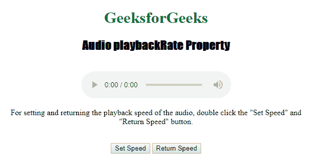
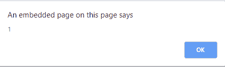
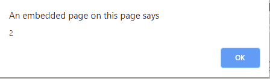

# HTML | DOM 音频播放包属性

> 原文:[https://www . geesforgeks . org/html-DOM-audio-playback rate-property/](https://www.geeksforgeeks.org/html-dom-audio-playbackrate-property/)

**音频回放速率属性**用于*设置或返回音频的当前回放速度*。

**语法:**

*   返回 playbackRate 属性:

    ```html
    audioObject.playbackRate
    ```

*   设置 playbackRate 属性:

    ```html
    audioObject.playbackRate = playbackspeed
    ```

**属性值**

1.  **编号:**用于指定视频的默认播放速度。
    可用选项有:

*   *1.0* 为正常速度。
*   *0.5* 为半速。
*   *2.0* 为倍速。
*   *-1.0* 向后，正常速度。
*   *-0.5* 向后，半速。

**返回:**音频**回放速率**属性返回一个代表当前回放速度的数字。

下面的程序说明了音频回放速率属性:
**示例:**默认将视频设置为双倍速度。

```html
<!DOCTYPE html>
<html>

<head>
    <title>
        Audio playbackRate Property
    </title>
</head>

<body style="text-align:center">

    <h1 style="color:green">
      GeeksforGeeks
    </h1>
    <h2 style="font-family: Impact">
      Audio playbackRate Property
    </h2>
    <br>

    <audio id="Test_Audio" controls>
        <source src="sample1.ogg"
                type="audio/ogg">

        <source src="sample1.mp3" 
                type="audio/mpeg">
    </audio>

    <p>For setting and returning the playback
      speed of the audio, double click the 
      "Set Speed" and "Return Speed" button.</p>
    <br>

    <button ondblclick="MyAudioSet()" 
            type="button">
      Set Speed
    </button>
    <button ondblclick="MyAudioReturn()" 
            type="button">
      Return Speed
    </button>
    <p id="test"></p>

    <script>
        var a = document.getElementById("Test_Audio");

        function MyAudioReturn() {
            a.playbackRate;
            alert(a.playbackRate);
        }

        function MyAudioSet() {
            a.playbackRate = 2;
        }
    </script>

</body>

</html>
```

**输出:**

*   最初:
    
*   点击“设置速度”按钮前:
    
*   点击“返回速度”按钮后:
    

**支持的浏览器:**T2 DOM 音频播放包属性支持的浏览器如下:

*   谷歌 Chrome
*   微软公司出品的 web 浏览器
*   火狐浏览器
*   歌剧
*   苹果 Safari