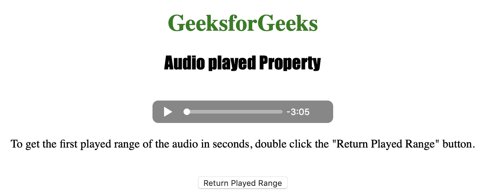
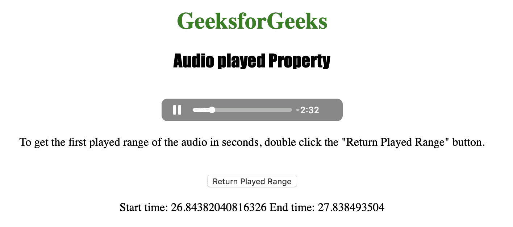

# HTML | DOM 音频播放属性

> 原文:[https://www . geesforgeks . org/html-DOM-audio-played-property/](https://www.geeksforgeeks.org/html-dom-audio-played-property/)

**音频播放属性**用于*返回一个时间范围对象*。“时间范围”对象用于表示用户已经播放的音频范围的情况。

播放范围是播放音频的时间范围。如果用户跳过音频，他可能会获得几个播放范围。
播放的音频属性为只读属性。

时间范围对象属性包括:

*   *长度*–用于获取视频中播放范围的数量。
*   *开始(索引)*–用于获取一个播放范围的开始位置。
*   *end(index)*–用于获取一个播放范围的结束位置。

**语法:**

```html
audioObject.played
```

下面的程序说明了音频播放属性:
**示例:**获取音频的第一个播放范围(秒)。

```html
<!DOCTYPE html>
<html>

<head>
    <title>
        Audio played Property
    </title>
</head>

<body style="text-align:center">

    <h1 style=" color:green">
      GeeksforGeeks
    </h1>
    <h2 style="font-family: Impact">
      Audio played Property
    </h2>
    <br>

    <audio id="Test_Audio" controls>
        <source src="sample1.ogg" type="audio/ogg">
        <source src="sample1.mp3" type="audio/mpeg">
    </audio>

    <p>To get the first played range of the 
      audio in seconds, double click the 
      "Return Played Range" button.</p>
    <br>

    <button ondblclick="MyAudio()" 
            type="button">
      Return Played Range
    </button>

    <p id="test"></p>

    <script>
        var a = document.getElementById("Test_Audio");

        function MyAudio() {
            var a = document.getElementById("Test_Audio");
            document.getElementById("test").innerHTML = 
            "Start time: " + a.played.start(0) 
            + " End time: " + a.played.end(0);
        }
    </script>

</body>

</html>
```

**输出:**

*   点击按钮前:
    
*   点击按钮后:
    

**支持的浏览器:**T2 DOM Audio played Property 支持的浏览器如下:

*   谷歌 Chrome
*   微软公司出品的 web 浏览器
*   火狐浏览器
*   歌剧
*   苹果 Safari