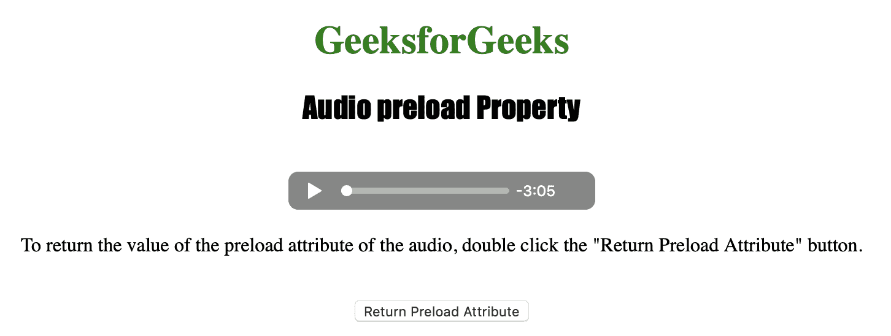
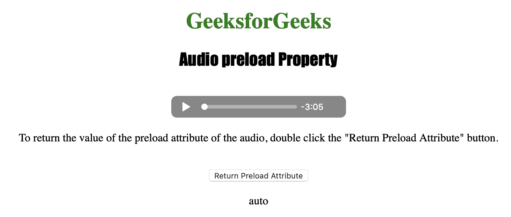

# HTML | DOM 音频预加载属性

> 原文:[https://www . geesforgeks . org/html-DOM-audio-preload-property/](https://www.geeksforgeeks.org/html-dom-audio-preload-property/)

**音频预载属性**用于*设置或返回音频预载属性*的值。preload 属性用于指定页面加载时作者认为应该加载音频的方式。
音频预载属性允许作者向浏览器描述网站用户体验的实现方式。
**语法:**

*   返回预加载属性:

```html
audioObject.preload
```

*   设置预载属性:

```html
audioObject.preload = "auto | metadata | none"
```

**房产价值:**

1.  **auto :** 用于指定页面加载时浏览器应加载整个视频。
2.  **元数据:**用于指定页面加载时浏览器只加载元数据。
3.  **无:**用于指定页面加载时浏览器不应加载视频。

**返回值:**它返回一个字符串值，该值指定应该在音频文件中预加载什么类型数据。

下面的程序说明了音频预加载属性:
**示例:**找出页面加载时发布者希望音频加载的方式。

## 超文本标记语言

```html
<!DOCTYPE html>
<html>

<head>
    <title>
        Audio preload Property
    </title>
</head>

<body style="text-align: center">

    <h1 style="color: green">
      GeeksforGeeks
    </h1>
    <h2 style="font-family: Impact">
      Audio preload Property
    </h2>
    <br>

    <audio id="Test_Audio" controls>
        <source src="sample1.ogg" type="audio/ogg">
        <source src="sample1.mp3" type="audio/mpeg">
    </audio>

<p>To return the value of the preload
      attribute of the audio, double click
      the "Return Preload Attribute" button.</p>

    <br>

    <button ondblclick="MyAudio()"
            type="button">
      Return Preload Attribute
    </button>

    <p id="test"></p>

    <script>
        var a = document.getElementById("Test_Audio");

        function MyAudio() {
            var a =
                document.getElementById("Test_Audio").preload;
            document.getElementById(
              "test").innerHTML = a;
        }
    </script>

</body>

</html>
```

**输出:**

*   点击按钮前:



*   点击按钮后:



**支持的浏览器:**T2 DOM 音频预加载属性支持的浏览器如下:

*   谷歌 Chrome
*   微软公司出品的 web 浏览器
*   火狐浏览器
*   歌剧
*   苹果 Safari