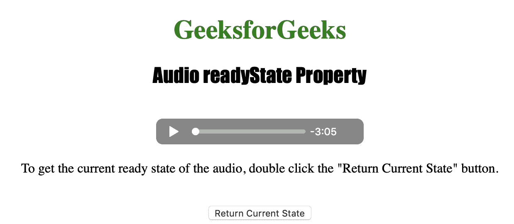
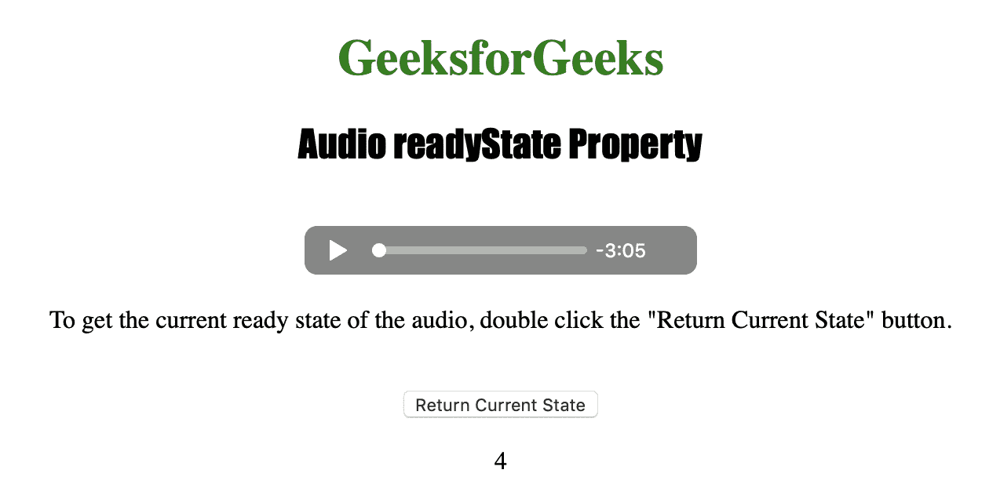

# HTML | DOM 音频就绪状态属性

> 原文:[https://www . geesforgeks . org/html-DOM-audio-readystate-property/](https://www.geeksforgeeks.org/html-dom-audio-readystate-property/)

**音频就绪状态属性**用于*返回音频的当前就绪状态*。就绪状态用于指示音频是否准备好播放。音频就绪状态属性是只读属性。

描述不同就绪状态的各种数字如下:

*   **0 = HAVE_NOTHING:** 没有与视频是否准备好相关的信息。
*   **1 = HAVE_METADATA:** 表示视频的元数据准备好了。
*   **2 = HAVE_CURRENT_DATA:** 表示当前播放位置的数据可用，但没有足够的数据播放下一帧/毫秒。
*   **3 = HAVE_FUTURE_DATA:** 表示当前帧和至少下一帧的数据可用。
*   **4 = HAVE _ stow _ DATA:**告知有足够的数据可以开始播放。

**语法:**

```html
audioObject.readyState
```

下面的程序说明了音频就绪状态属性:
**示例:**获取音频的当前就绪状态。

```html
<!DOCTYPE html>
<html>

<head>
    <title>
        Audio readyState Property
    </title>
</head>

<body style="font-family: Impact">

    <h1 style="color: green">
      GeeksforGeeks
    </h1>
    <h2 style="font-family: Impact">
      Audio readyState Property
    </h2>
    <br>

    <audio id="Test_Audio" controls>
        <source src="sample1.ogg" 
                type="audio/ogg">

        <source src="sample1.mp3" 
                type="audio/mpeg">
    </audio>

    <p>To get the current ready state of the audio, 
      double click the "Return Current State" button.</p>
    <br>

    <button ondblclick="MyAudio()" type="button">
        Return Current State
    </button>

    <p id="test"></p>

    <script>
        function MyAudio() {
            var a = document.getElementById(
                "Test_Audio").readyState;

            document.getElementById(
                "test").innerHTML = a;
        }
    </script>

</body>

</html>
```

**输出:**

*   点击按钮前:
    
*   点击按钮后:
    

**支持的浏览器:***DOM Audio readyState Property*支持的浏览器如下:

*   谷歌 Chrome
*   微软公司出品的 web 浏览器
*   火狐浏览器
*   歌剧
*   苹果 Safari