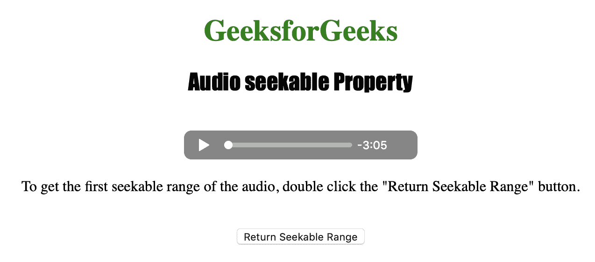
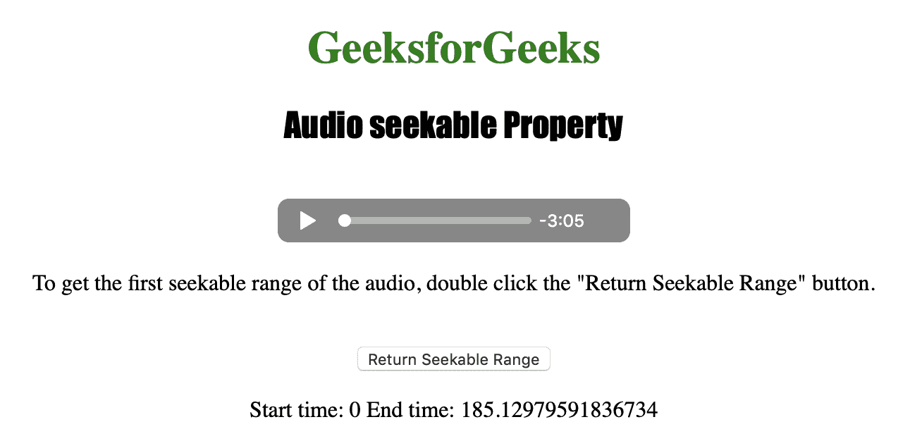

# HTML | DOM 音频可搜索属性

> 原文:[https://www . geesforgeks . org/html-DOM-audio-seekable-property/](https://www.geeksforgeeks.org/html-dom-audio-seekable-property/)

**DOM 音频可搜索属性**用于*返回时间范围对象*。时间范围对象用于表示可供用户搜索的音频范围。
可用于搜索(即移动播放位置)的音频时间范围称为可搜索范围。
如果是非流式音频，即使在音频被缓冲之前，也经常可以在音频中的任何位置进行查找。
音频可搜索属性是只读属性。

时间范围对象属性包括:

*   长度:用于获取音频中可查找范围的数量。
*   开始(索引):用于获取可查找范围的位置。
*   end(index):用于获取可查找范围的结束位置。

**语法:**

```html
audioObject.seekable
```

下面的程序说明了音频的可搜索属性:
**示例:**以秒为单位获取音频的第一个可搜索范围。

```html
<!DOCTYPE html>
<html>

<head>
    <title>
        Audio seekable Property
    </title>
</head>

<body style="text-align:center">

    <h1 style="color:green">
      GeeksforGeeks
    </h1>
    <h2 style="font-family: Impact">
      Audio seekable Property
    </h2>
    <br>

    <audio id="Test_Audio" controls>
        <source src="sample1.ogg" 
                type="audio/ogg">

        <source src="sample1.mp3"
                type="audio/mpeg">
    </audio>

    <p>To get the first seekable range of the audio,
      double click the "Return Seekable Range" button.
    </p>
    <br>

    <button ondblclick="MyAudio()" 
            type="button"> 
      Return Seekable Range 
    </button>

    <p id="test"></p>

    <script>
        function MyAudio() {
            var a = document.getElementById("Test_Audio");
            document.getElementById("test").innerHTML = 
              "Start time: " + a.seekable.start(0) + 
              " End time: " + a.seekable.end(0);
        }
    </script>

</body>

</html>
```

**输出:**

*   点击按钮前:
    
*   点击按钮后:
    

**支持的浏览器:***DOM 音频可搜索属性*支持的浏览器如下:

*   谷歌 Chrome
*   微软公司出品的 web 浏览器
*   火狐浏览器
*   歌剧
*   苹果 Safari