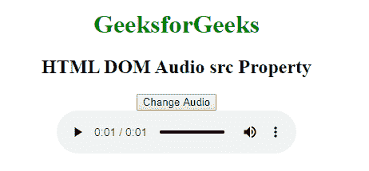

# HTML | DOM 音频 src 属性

> 原文:[https://www.geeksforgeeks.org/html-dom-audio-src-property/](https://www.geeksforgeeks.org/html-dom-audio-src-property/)

**DOM Audio src 属性**用于设置或返回音频的 src 属性值。src 属性通常用于指定音频文件的位置(URL)。

**语法:**

*   返回 src 属性:

    ```html
    audioObject.src
    ```

*   设置 src 属性:

    ```html
    audioObject.src = URL
    ```

**属性值:**

*   **URL:** 用于指定视频文件的 URL。

**返回值:**Audio src 属性返回一个字符串，代表音频文件的 URL。src 属性返回整个 URL，包括协议。

**示例:**

```html
<!DOCTYPE html>
<html>

<body>
    <center>
        <h1 style="color:green">GeeksforGeeks</h1>
        <h2>HTML DOM Audio src Property</h2>

        <button onclick="my_Audio()" type="button">
            Change Audio
        </button>
        <br>

        <audio id="myAudio" controls autoplay>
            <source id="mp4_src" src=
"https://media.geeksforgeeks.org/wp-content/uploads/20190531165842/Recording1514.ogg" 
                    type="audio/mp3">

            <source id="ogg_src" src=
"https://media.geeksforgeeks.org/wp-content/uploads/20190625153922/frog.mp3"
                    type="audio/ogg">
        </audio>

        <script>
            function my_Audio() {
                document.getElementById("ogg_src").src = 
"https://media.geeksforgeeks.org/wp-content/uploads/20190531165842/Recording1514.ogg";

                document.getElementById("mp4_src").src =
"https://media.geeksforgeeks.org/wp-content/uploads/20190625153922/frog.mp3";

                document.getElementById("myAudio").load();
            }
        </script>
    </center>
</body>

</html>
```

**输出:**


**支持的浏览器:**以下是 **HTML DOM Audio src Property** 支持的浏览器:

*   谷歌 Chrome
*   微软公司出品的 web 浏览器
*   边缘
*   火狐浏览器
*   苹果 Safari