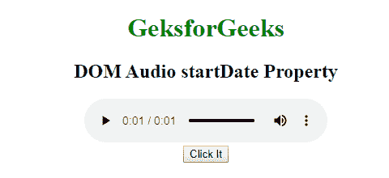
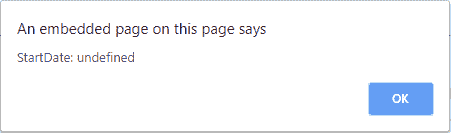

# HTML | DOM 音频开始日期属性

> 原文:[https://www . geesforgeks . org/html-DOM-audio-start date-property/](https://www.geeksforgeeks.org/html-dom-audio-startdate-property/)

**开始日期属性**用于返回代表音频当前时间线的日期对象。它用于实现通过互联网实时传输的音频的精确同步。

**语法:**

```html
audio.startDate
```

**返回值:**一个日期对象，表示当前时间线偏移。

**示例:**

```html
<!DOCTYPE html>
<html>

<head>
    <title>
        HTML DOM Audio startDate Property
    </title>
</head>

<body style="text-align:center;">

    <h1 style="color:green">GeeksforGeeks</h1>

    <h2>DOM Audio startDate Property</h2>

    <audio id="my_Audio" controls autoplay>
        <source id="mp4_src" src=
"https://media.geeksforgeeks.org/wp-content/uploads/20190531165842/Recording1514.ogg"
                type="audio/mp3">

        <source id="ogg_src" src=
"https://media.geeksforgeeks.org/wp-content/uploads/20190625153922/frog.mp3"
                type="audio/ogg">
    </audio>
    <br>

    <button onclick="myAudio()" type="button">
        Click It
    </button>
    <br>

    <script>
        var a = document.getElementById("my_Audio");

        function myAudio() {
            alert("StartDate: " + a.startDate);
        }
    </script>
</body>

</html>
```

**输出:**

*   **之前点击按钮:**
    
*   **点击按钮后:**
    

**支持的浏览器:****HTML DOM 音频开始日期属性**不被任何浏览器支持。