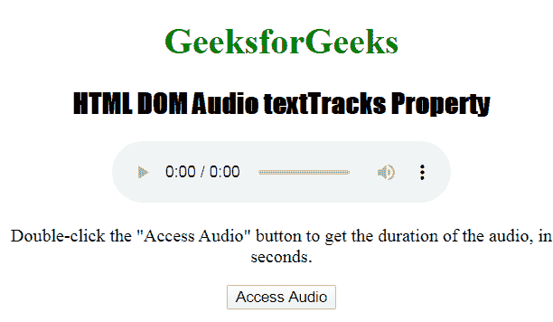
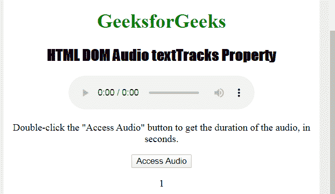

# HTML | DOM 音频文本轨道属性

> 原文:[https://www . geesforgeks . org/html-DOM-audio-text tracks-property/](https://www.geeksforgeeks.org/html-dom-audio-texttracks-property/)

**HTML DOM 音频文本跟踪属性**用于返回一个文本跟踪列表对象。
文本轨道列表对象表示音频的可用文本轨道。每个可用的文本轨道都由一个文本轨道对象表示。

**语法:**

```html
audioObject.textTracks 
```

**返回值:**返回一个文本轨迹列表对象，代表音频的可用文本轨迹。
T3】文本跟踪列表对象为:

*   **长度:**用于获取音频中可用的文本轨道数
*   **【索引】:**用于通过索引获取 TextTrack 对象

**示例:**

```html
<!DOCTYPE html> 
<html> 

<head> 
    <title>HTML DOM Audio textTracks Property

</title> 
    <style> 
        h1 { 
            color: green; 
        } 

        h2 { 
            font-family: Impact; 
        } 

        body { 
            text-align: center; 
        } 
    </style> 
</head> 

<body> 

    <h1>GeeksforGeeks</h1> 
    <h2>HTML DOM Audio textTracks Property

</h2> 

    <audio id="track" controls> 
        <source src="bells.ogg" type="audio/ogg"> 
        <source src="bells.mp3" type="audio/mpeg"> 
      <track src="demo_sub.vtt">

    Your browser does not support the audio element. 
    </audio> 

    <p>Double-click the "Access Audio" button 
    to get the duration of the audio, in seconds.</p> 

    <button onclick="access()">Access Audio</button> 

    <p id="test"></p> 

    <script> 
        function access() { 

            // Accessing audio element duration. 
            var m = document.getElementById( 
            "track").textTracks.length;; 
            document.getElementById("test").innerHTML = m; 
        } 
    </script> 

</body> 

</html> 
```

**输出:**
**点击按钮前:**

**点击按钮后:**


**支持的浏览器:****DOM 音频文本轨道属性** 支持的浏览器如下:

*   谷歌 Chrome
*   微软公司出品的 web 浏览器
*   火狐浏览器
*   歌剧
*   旅行队