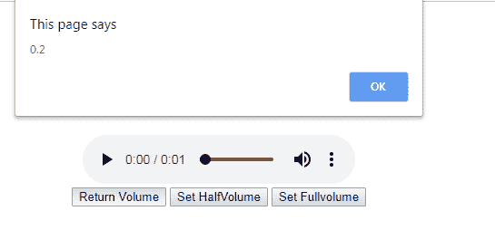
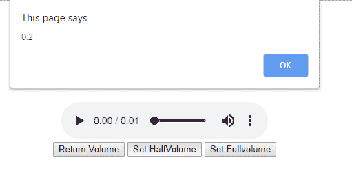
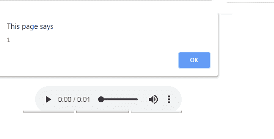

# HTML | DOM 音频音量属性

> 原文:[https://www . geesforgeks . org/html-DOM-audio-volume-property/](https://www.geeksforgeeks.org/html-dom-audio-volume-property/)

**HTML DOM 音频音量属性**用于设置或返回音频元素的当前音量。音量值 0.0 代表静音，1.0 代表最响。

**语法:**

*   它返回卷属性。

    ```html
    audio.volume

    ```

*   它设置音量属性。

    ```html
    audio.volume = number
    ```

**属性值:**包含代表音频音量值的单个属性值**号**。体积的值有:

*   **1.0:** 为最高音量。这是默认值。
*   **0.5:** 用于指定半体积。
*   **0.0:** 用于指定零音量/静音/静音。

**返回值:**返回一个代表音频元素当前音量的数值。

下面的程序说明了在 HTML DOM 中的音频音量属性:

**示例:**

```html
<!DOCTYPE html> 
<html> 

<head> 
    <title> 
        HTML DOM Audio Volume Property 
    </title> 
</head> 

<body style="text-align: center"> 

    <h1 style="color: green"> 
        GeeksforGeeks 
    </h1> 

    <h2 style="font-family: Impact"> 
        HTML DOM Audio Volume Property 
    </h2> 
    <br> 

    <audio id="Test_Audio" controls> 

        <source src= 
"https://media.geeksforgeeks.org/wp-content/uploads/20190531165842/Recording1514.ogg"
                type="audio/ogg"> 

        <source src= 
"https://media.geeksforgeeks.org/wp-content/uploads/20190531165842/Recording1514.mp3"
                type="audio/mpeg"> 
    </audio><br>

    <button onclick="volume()" type="button">
        Return Volume
    </button>

    <button onclick="Set_vol1()" type="button">
        Set HalfVolume
    </button>

    <button onclick="Set_vol2()" type="button">
        Set Fullvolume 
    </button><br> 

    <script>
        var gfg = document.getElementById("Test_Audio");

        function volume() { 
            alert(gfg.volume);
        } 

        function Set_vol1() { 
            gfg.volume = 0.2;
        } 

        function Set_vol2() { 
            gfg.volume = 1.0;
        } 
    </script> 
</body> 

</html>
```

**输出:**

*   **点击按钮前:**
    
*   **点击返回音量按钮后:**
    
*   **点击设置半音量按钮后:**
    
*   **点击设置音量按钮后:**
    