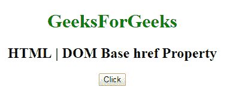

# HTML | DOM Base href 属性

> 原文:[https://www.geeksforgeeks.org/html-dom-base-href-property/](https://www.geeksforgeeks.org/html-dom-base-href-property/)

HTML DOM 中的 **DOM Base href 属性**用于**设置**或**返回** *一个 [< base >](https://www.geeksforgeeks.org/html-base-tag/) 元素*的 href 属性值。 **href 属性**用于指定网页中所有相对网址的基本网址。

**语法:**

*   它返回 href 属性。

    ```html
    baseObject.href
    ```

*   It is used to set the href property.

    ```html
    baseObject.href = URL
    ```

    **属性值:**包含指定网页基本网址的值，即**网址**。

    **返回值:**返回一个字符串值，代表网页的基本网址，包括协议名称。

    **示例:**本示例返回 href 属性。

    ```html
    <!DOCTYPE html>
    <html>

    <head>
        <base id="Geek_Base" 
              href="https://www.geeksforgeeks.org">
        <title>
            HTML | DOM Base href Property
        </title>
    </head>

    <body style="text-align:center;">

        <h1 style="color:green;"> 
                GeeksForGeeks 
            </h1>

        <h2>
          HTML | DOM Base href Property
      </h2>

        <button onclick="myGeeks()">
            Click
        </button>
        <h4><p id="Geek_p" 
               style="color:green;
                      font-size:24px;">
          </p>
      </h4>

        <script>
            function myGeeks() {

                // returninh the href Propertyt. 
                var x =
                    document.getElementById(
                        "Geek_Base").href;

                document.getElementById(
                    "Geek_p").innerHTML = x;
            }
        </script>
    </body>

    </html>
    ```

    **输出:**

    **点击按钮前:**
    
    **点击按钮后:**
    

    **示例-2 :** 本示例设置 href 属性。

    ```html
    <!DOCTYPE html>
    <html>

    <head>
        <base id="Geek_Base"
              href="https://www.geeksforgeeks.org">
        <title>
            HTML | DOM Base href Property
        </title>
    </head>

    <body style="text-align:center;">

        <h1 style="color:green;"> 
                GeeksForGeeks 
            </h1>

        <h2>
          HTML | DOM Base href Property
      </h2>

        <button onclick="myGeeks()">
            Click
        </button>
        <h4><p id="Geek_p"
               style="color:green;
                      font-size:24px;">
          </p>
      </h4>

        <script>
            function myGeeks() {

                // returninh the href Propertyt. 
                var x =
                    document.getElementById(
                    "Geek_Base").href = "https://www.finecomb.com/";

                document.getElementById(
                    "Geek_p").innerHTML = 
                "the value of the href attribute was changed to " + x;
            }
        </script>
    </body>

    </html>
    ```

    **输出:**
    **点击按钮前:**
    

    **点击按钮后:**
    

    **支持的浏览器:****DOM base href 属性**支持的浏览器如下:

    *   谷歌 Chrome
    *   Internet Explorer 10.0 +
    *   火狐浏览器
    *   歌剧
    *   旅行队