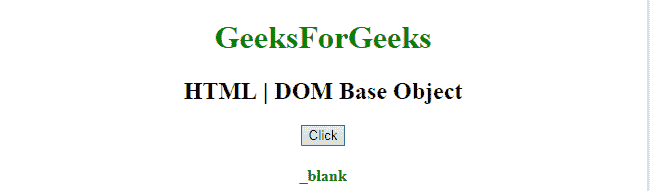

# HTML | DOM 基础对象

> 原文:[https://www.geeksforgeeks.org/html-dom-base-object/](https://www.geeksforgeeks.org/html-dom-base-object/)

HTML DOM 中的**基对象**用来表示 HTML [<基>](https://www.geeksforgeeks.org/html-base-tag/) 元素。
此标签用于*设置*或*获取<基础>元素的*属性。使用 **getElementById()** 方法可以访问该元素。
**语法:**

```html
document.getElementById("Base_ID");
```

这个**“Base _ ID”**被分配给 HTML strong < base > 元素。
**对象属性:**

*   [**href:**](https://www.geeksforgeeks.org/html-dom-base-href-property/?ref=rp) 用于设置或返回基元素中的 href 属性。
*   [**目标:**](https://www.geeksforgeeks.org/html-dom-base-target-property/?ref=rp) 用于设置或返回一个基础元素中的目标属性。

**示例-1:** 返回基础元素的 **href 值**。

## 超文本标记语言

```html
<!DOCTYPE html>
<html>

<head>
    <base id="Geek_Base"
          href="https://www.geeksforgeeks.org">
    <title>
        HTML | DOM Base Object
    </title>
</head>

<body style="text-align:center;">

    <h1 style="color:green;"> 
            GeeksForGeeks 
        </h1>

    <h2>HTML | DOM Base Object</h2>

    <button onclick="myGeeks()">
        Click
    </button>
    <h4><p id="Geek_p" style="color:green"></p>
</h4>

    <script>
        function myGeeks() {

            // Accessing base object.
            var x =
                document.getElementById(
                  "Geek_Base").href;

            document.getElementById(
              "Geek_p").innerHTML = x;
        }
    </script>
</body>

</html>
```

**输出:**

*   **之前点击按钮:**


*   **点击按钮后:**


**例-2:** 返回基元目标值，本例为 **_blank** 。

## 超文本标记语言

```html
<!DOCTYPE html>
<html>

<head>
    <base id="Geek_Base" target="_blank">
    <title>
        HTML | DOM Base Object
    </title>
</head>

<body style="text-align:center;">

    <h1 style="color:green;"> 
            GeeksForGeeks 
        </h1>

    <h2>HTML | DOM Base Object</h2>

    <button onclick="myGeeks()">
        Click
    </button>
    <h4><p id="Geek_p" style="color:green"></p>
</h4>

    <script>
        function myGeeks() {
            var x =
            document.getElementById(
              "Geek_Base").target;

            document.getElementById(
              "Geek_p").innerHTML = x;
        }
    </script>
</body>

</html>
```

**输出:**

*   **之前点击按钮:**


*   **点击按钮后:**



**例-3:** 返回基元的**目标值**。

## 超文本标记语言

```html
<!DOCTYPE html>
<html>

<head>
    <base id="Geek_Base"
          target="_parent">
    <title>
        HTML | DOM Base Object
    </title>
</head>

<body style="text-align:center;">

    <h1 style="color:green;"> 
            GeeksForGeeks 
        </h1>

    <h2>HTML | DOM Base Object</h2>

    <button onclick="myGeeks()">
        Click
    </button>
    <h4><p id="Geek_p" style="color:green">
      </p>
</h4>

    <script>
        function myGeeks() {
            var x =
            document.getElementById(
              "Geek_Base").target;

            document.getElementById(
              "Geek_p").innerHTML = x;
        }
    </script>
</body>

</html>
```

**输出:**

*   **之前点击按钮:**


*   **点击按钮后:**


**支持的浏览器:**

*   谷歌 Chrome
*   Mozilla Firefox
*   边缘
*   旅行队
*   歌剧