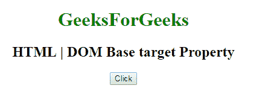
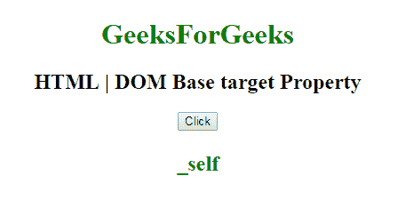
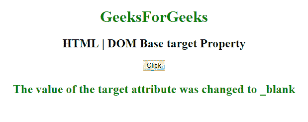

# HTML | DOM 基础目标属性

> 原文:[https://www . geesforgeks . org/html-DOM-base-target-property/](https://www.geeksforgeeks.org/html-dom-base-target-property/)

HTML DOM 中的**基础目标属性**用于设置或返回<基础>元素的目标属性值。**目标属性**用于指定页面中所有超链接和表单的默认目标。

**语法:**

*   它返回基本目标属性。

    ```html
    baseObject.target
    ```

*   它用于设置基本目标属性。

    ```html
    baseObject.target = "_blank|_self|_parent|_top|framename"
    ```

**属性值:**

*   **_blank:** 用于在新窗口打开链接。
*   **_self:** 用于打开同一个框架中的链接。
*   **_parent:** 用于打开父框架集中的链接。
*   **_top:** 它在窗口的整个主体中打开一个链接。
*   **framename:** 它以 dframe 的名称打开一个链接。

**返回值:**返回一个字符串值，代表页面中所有超链接和表单的默认目标。

**示例 1:** 本示例返回基本目标属性。

```html
<!DOCTYPE html> 
<html> 

<head> 
    <base id="Geek_Base"
        href="https://www.geeksforgeeks.org" target="_self"> 
    <title> 
        HTML | DOM Base target Property 
    </title> 
</head> 

<body style="text-align:center;"> 

    <h1 style="color:green;"> 
            GeeksForGeeks 
        </h1> 

    <h2>HTML | DOM Base target Property</h2> 

    <button onclick="myGeeks()"> 
        Click 
    </button> 

    <h4 id="Geek_p" style="color:green;font-size:24px;"></h4> 

    <!-- Script to use DOM Base target Property -->
    <script> 
        function myGeeks() { 

            var x = document.getElementById("Geek_Base").target; 

            document.getElementById("Geek_p").innerHTML = x; 
        } 
    </script> 
</body> 

</html>                    
```

**输出:**
**点击按钮前:**

**点击按钮后:**


**示例 2:** 本示例设置基本目标属性。

```html
<!DOCTYPE html> 
<html> 

<head> 
    <base id="Geek_Base" href=
    "https://www.geeksforgeeks.org" target="_self"> 

    <title> 
        HTML | DOM Base target Property 
    </title> 
</head> 

<body style="text-align:center;"> 

    <h1 style="color:green;"> 
            GeeksForGeeks 
        </h1> 

    <h2>HTML | DOM Base target Property</h2> 

    <button onclick="myGeeks()"> 
        Click 
    </button> 

    <h4 id="Geek_p" style="color:green;font-size:24px;"></h4> 

    <!-- Script to use DOM Base target Property -->
    <script> 
        function myGeeks() { 

            var x = document.getElementById("Geek_Base").target
                = "_blank"; 

            document.getElementById("Geek_p").innerHTML
                = "The value of the target attribute was "
                + "changed to " + x; 
        } 
    </script> 
</body> 

</html>                    
```

**输出:**
**点击按钮前:**

**点击按钮后:**


**支持的浏览器:****DOM 基目标属性**支持的浏览器如下:

*   谷歌 Chrome
*   微软公司出品的 web 浏览器
*   火狐浏览器
*   歌剧
*   旅行队