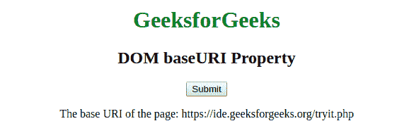

# HTML | DOM baseURI 属性

> 原文:[https://www.geeksforgeeks.org/html-dom-baseuri-property/](https://www.geeksforgeeks.org/html-dom-baseuri-property/)

**DOM 基本 URI 属性**用于返回文档的基本统一资源标识符(URI)。此属性用于只读。此属性返回一个字符串值，该值代表页面的基本 URI。
**语法:**

```html
node.baseURI
```

**返回值:I** t 返回一个代表节点 URL 的字符串值；s 页。

**例:**

## 超文本标记语言

```html
<!DOCTYPE html>
<html>
    <body>
        <title>baseURI property</title>
        <style>
            h1 {
                color:green;
            }
            body {
                text-align:center;
            }
        </style>
    </head>
    <body>
        <h1>GeeksforGeeks</h1>
        <h2>DOM baseURI Property</h2>
        </h2>
        <button onclick = "geeks()">Submit</button>
        <p id="gfg"></p>

        <script>
            function geeks() {
                var x = document.baseURI;
                document.getElementById("gfg").innerHTML =
                    "The base URI of the page: " + x;
            }
        </script>
    </body>
</html>                   
```

**输出:**



**支持的浏览器:**T2 DOM baseURI 属性支持的浏览器如下:

*   谷歌 Chrome
*   火狐浏览器
*   歌剧
*   旅行队