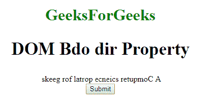
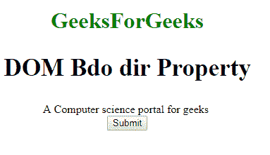
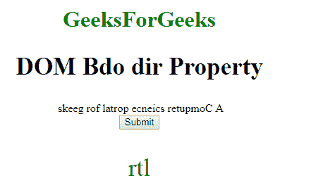

# HTML | DOM Bdo dir 属性

> 原文:[https://www.geeksforgeeks.org/html-dom-bdo-dir-property/](https://www.geeksforgeeks.org/html-dom-bdo-dir-property/)

HTML DOM 中的 **Bdo dir 属性**用于设置或返回元素文本方向的值。**目录**属性定义元素的文本方向。

**语法:**

*   它用于返回文本方向属性。

    ```html
    bdoObject.dir
    ```

*   它用于设置文本方向属性。

    ```html
    bdoObject.dir = "ltr|rtl"
    ```

**属性值:**

*   **ltr:** 定义从左到右的文字方向。
*   **rtl:** 定义从右向左的文字方向。

**返回值:**返回一个代表元素文本方向的字符串值。

**示例 1:** 本示例说明如何设置 dir 属性。

```html
<!DOCTYPE html> 
<html> 

    <head> 
        <title>
            HTML DOM Bdo dir Property
        </title>
    </head> 

    <body style="text-align:center;"> 

        <h1>GeeksForGeeks</h1> 

        <h2>DOM Bdo dir Property</h2> 

        <bdo id="GFG" dir="rtl"> 
            A Computer science portal for geeks 
        </bdo><br> 

        <button onclick="myGeeks()">
            Submit
        </button> 

        <script> 
            function myGeeks() { 
                document.getElementById("GFG").dir = "ltr";
            } 
        </script> 
    </body> 
</html>                    
```

**输出:**
**点击按钮前:**

**点击按钮后:**


**示例 2:** 这个示例说明了如何返回 dir 属性。

```html
<!DOCTYPE html> 
<html> 
    <head> 
        <title>
            HTML DOM Bdo dir Property
        </title>
    </head> 

    <body style="text-align:center;"> 

        <h1>GeeksForGeeks</h1>

        <h2>DOM Bdo dir Property</h2> 

        <bdo id="GFG" dir="rtl"> 
            A Computer science portal for geeks 
        </bdo><br> 

        <button onclick="myGeeks()">
            Submit
        </button>

        <p id="sudo" style="font-size:35px;color:green;"></p> 

        <script> 
            function myGeeks() { 
                var w = document.getElementById("GFG").dir;
                document.getElementById("sudo").innerHTML = w;
            } 
        </script> 
    </body> 
</html>                    
```

**输出:**
**点击按钮前:**

**点击按钮后:**


**支持的浏览器:**T2 DOM Bdo dir 属性支持的浏览器如下:

*   谷歌 Chrome
*   微软公司出品的 web 浏览器
*   火狐浏览器
*   歌剧
*   旅行队