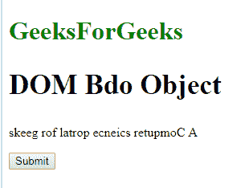
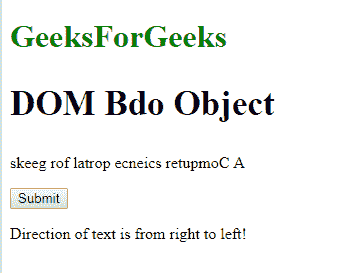
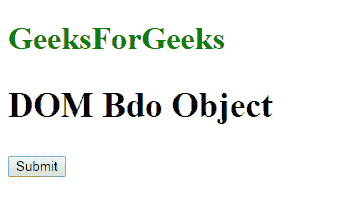
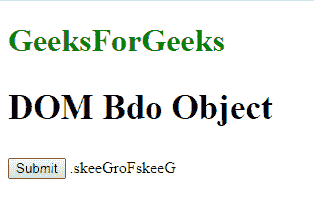

# HTML | DOM Bdo 对象

> 原文:[https://www.geeksforgeeks.org/html-dom-bdo-object/](https://www.geeksforgeeks.org/html-dom-bdo-object/)

**DOM Bdo 对象**用于表示 HTML < Bdo >元素。双向元素由 getElementById()访问。
**属性:**它有一个 [**di**](https://www.geeksforgeeks.org/html-dom-bdo-dir-property/?ref=rp) **r** 属性，用于设置或返回元素的文本方向。
**语法:**

```html
document.getElementById("GFG");
```

其中“GFG”是分配给**“bdo”**标签的 ID。
**示例-1:**

## 超文本标记语言

```html
<!DOCTYPE html>
<html>

<body>

    <head>
        <style>
            h1 {
                color: green;
            }

            h2 {
                font-size: 35px;
            }
        </style>
    </head>

    <body>
        <h1>GeeksForGeeks</h1>
        <h2>DOM Bdo Object</h2>
        <bdo id="GFG" dir="rtl">
          A Computer science portal for geeks
        </bdo>
        <br>
        <button onclick="myGeeks()">Submit</button>
        <p id="sudo"></p>

        <script>
            function myGeeks() {
                var w = document.getElementById("GFG");
                if (w.dir === "rtl") {
                    document.getElementById("sudo").innerHTML =
                        "right to left text direction";
                } else {
                    document.getElementById("sudo").innerHTML =
                        " left to right text direction.";
                }
            }
        </script>

    </body>

</html>
```

**输出:**
**点击按钮前:**



**点击按钮后:**



**示例-2:** 可以使用**文档.创建元素**方法创建 Bdo 对象。

## 超文本标记语言

```html
<!DOCTYPE html>
<html>

<body>

    <head>
        <style>
            h1 {
                color: green;
            }

            h2 {
                font-size: 35px;
            }
        </style>
    </head>

    <body>
        <h1>GeeksForGeeks</h1>
        <h2>DOM Bdo Object</h2>
        <button onclick="myGeeks()">Submit</button>

        <script>
            function myGeeks() {
                var g = document.createElement("BDO");
                var f = document.createTextNode("GeeksForGeeks.");
                g.setAttribute("dir", "rtl");
                g.appendChild(f);
                document.body.appendChild(g);
            }
        </script>

    </body>

</html>
```

**输出:**
**点击按钮前:**



**点击按钮后:**



**支持的浏览器:**T2 DOM Bdo 对象支持的浏览器如下:

*   谷歌 Chrome
*   微软公司出品的 web 浏览器
*   火狐浏览器
*   歌剧
*   旅行队