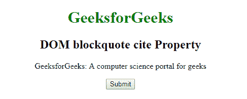
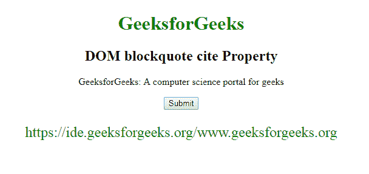
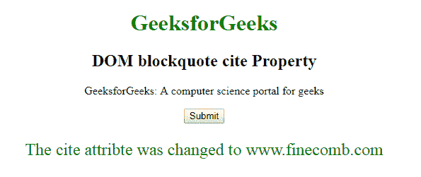

# HTML | DOM 块引用属性

> 原文:[https://www . geesforgeks . org/html-DOM-block quote-cite-property/](https://www.geeksforgeeks.org/html-dom-blockquote-cite-property/)

HTML DOM 中的 **blockquote 引用属性**用于设置或返回引用的引用属性的值。用于指定报价的网址。它不包含任何普通网页浏览器上的视觉效果。它只能由屏幕阅读器使用。

**语法:**

*   它返回 blockquote 引用属性。

    ```html
    blockquoteObject.cite
    ```

*   它用于设置 blockquote 引用属性。

    ```html
    blockquoteObject.cite = URL
    ```

**属性值:**包含单个值 **URL** ，指定报价的 URL。该网址包含下面列出的两个可能值:

*   **绝对 URL:** 用于指代对方网站。例如 cite = " https://www . geesforgeks . org "
*   **Relative URL:** It is used to refer to the web page within the website. For example cite = “geeks.htm

    **示例 1:** 本示例返回 blockquote 引用属性。

    ```html
    <!DOCTYPE html> 
    <html> 

    <head> 
        <title>
            HTML DOM blockquote cite Property
        </title> 
    </head> 

    <body style="text-align:center;"> 

        <h1 style="color:green;">GeeksforGeeks</h1> 
        <h2>DOM blockquote cite Property</h2> 

        <blockquote ID="GFG" cite="www.geeksforgeeks.org"> 
            GeeksforGeeks: A computer science portal for geeks 
        </blockquote> 

        <button onclick="myGeeks()">Submit</button> 

        <p id="sudo" style="color:green;font-size:24px;"></p> 

        <!-- Script to return blockquote cite Property -->
        <script> 
            function myGeeks() { 
                var w = document.getElementById("GFG").cite; 
                document.getElementById("sudo").innerHTML = w; 
            } 
        </script> 
    </body> 

    </html>                    
    ```

    **输出:**
    **点击按钮前:**
    
    **点击按钮后:**
    

    **示例 2:** 本示例设置 blockquote 引用属性。

    ```html
    <!DOCTYPE html> 
    <html> 

    <head> 
        <title>
            HTML DOM blockquote cite Property
        </title> 
    </head> 

    <body style="text-align:center;"> 

        <h1 style="color:green;">GeeksforGeeks</h1> 
        <h2>DOM blockquote cite Property</h2> 

        <blockquote ID="GFG" cite="www.geeksforgeeks.org"> 
            GeeksforGeeks: A computer science
            portal for geeks 
        </blockquote> 

        <button onclick="myGeeks()">Submit</button> 

        <p id="sudo" style="color:green;font-size:24px;"></p> 

        <!-- Script to set DOM blockquote cite Property -->
        <script> 
            function myGeeks() { 
                var w = document.getElementById("GFG").cite
                    = "www.gfg.org"; 

                document.getElementById("sudo").innerHTML
                    = "The cite attribte was changed to " + w; 
            } 
        </script> 
    </body> 

    </html>                    
    ```

    **输出:**
    **点击按钮前:**
    
    **点击按钮后:**
    

    **支持的浏览器:**T2 DOM block quote 属性支持的浏览器如下:

    *   谷歌 Chrome
    *   微软公司出品的 web 浏览器
    *   火狐浏览器
    *   歌剧
    *   旅行队