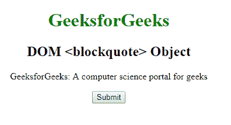

# HTML | DOM 块引用对象

> 原文:[https://www.geeksforgeeks.org/html-dom-blockquote-object/](https://www.geeksforgeeks.org/html-dom-blockquote-object/)

**DOM 块引用对象**用于表示 HTML <块引用>元素。getElementById()访问 Blockquote 元素。
**语法**

```html
document.getElementById("id");
```

其中“id”是分配给**区块引用**标签的 ID。
T3】房产价值

*   **引用:**用于设置或返回报价的引用属性的值

**示例-1:**

## 超文本标记语言

```html
<!DOCTYPE html>
<html>

<head>
    <title>DOM blockquote object</title>
    <style>
        body {
            text-align: center;
        }

        h1 {
            color: green;
        }
    </style>
</head>

<body>
    <h1>GeeksforGeeks</h1>
    <h2> DOM <blockquote> Object</h2>
    <blockquote ID="GFG" cite="www.geeksforgeeks.org">
      GeeksforGeeks: A computer science portal for geeks
    </blockquote>

    <button onclick="myGeeks()">Submit</button>

    <p id="sudo"></p>

    <script>
        function myGeeks() {
            var w = document.getElementById("GFG").cite;
            document.getElementById("sudo").innerHTML = w;
        }
    </script>
</body>

</html>             
```

**输出:**
**点击按钮前:**



**点击按钮后:**


**示例-2:** 可以使用 **document.createElement** 方法创建区块引用对象。

## 超文本标记语言

```html
<!DOCTYPE html>
<html>

<head>
    <title>DOM blockquote object</title>
    <style>
        body {
            text-align: center;
        }

        h1 {
            color: green;
        }
    </style>
</head>

<body>
    <h1>GeeksforGeeks</h1>
    <h2> DOM <blockquote> Object</h2>

    <button onclick="myGeeks()">Submit</button>

    <p id="sudo"></p>

    <script>
        function myGeeks() {
            var g = document.createElement("BLOCKQUOTE");
            var f = document.createTextNode("GeeksforGeeks:"+
                "A computer science portal for geeks.");

            g.setAttribute("cite", "www.geeksforgeeks.org");
            g.appendChild(f);
            document.body.appendChild(g);
        }
    </script>
</body>

</html>  
```

**输出:**
**点击按钮前:**


**点击按钮后:**


**支持的浏览器:****DOM block quote 对象**支持的浏览器如下:

*   谷歌 Chrome
*   微软公司出品的 web 浏览器
*   火狐浏览器
*   歌剧
*   旅行队