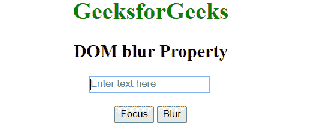
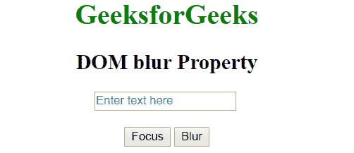

# HTML | DOM 模糊()方法

> 原文:[https://www.geeksforgeeks.org/html-dom-blur-method/](https://www.geeksforgeeks.org/html-dom-blur-method/)

DOM **模糊**方法用于从当前元素中移除键盘焦点，并借助[焦点()](https://www.geeksforgeeks.org/html-dom-focus-method/)方法给予焦点。我们可以将模糊应用于任何元素，并通过一些操作来启用它。例如，我们可以通过点击按钮模糊到文本框。

**语法:**

```html
Object.blur()
```

**示例:**

```html
<html>

<head>
    <title>HTML DOM blur Property</title>
</head>

<body style="text-align: center;">
    <h1 style="color:green;">
            GeeksforGeeks
        </h1>

    <h2>
            DOM blur Property
        </h2>

    <input type="text" id="txt" placeholder="Enter text here">
    <br>
    <br>
    <button type="button" onclick="inputFocus()">Focus</button>
    <button type="button" onclick="inputBlur()">Blur</button>

    <script>
        function inputFocus() {
            document.getElementById('txt').focus();
        }

        function inputBlur() {
            document.getElementById('txt').blur();
        }
    </script>
</body>

</html>
```

**输出:**
**点击聚焦按钮后:**


**点击模糊按钮后:**


**支持的浏览器:**下面列出了**模糊()**方法支持的浏览器:

*   谷歌 Chrome
*   微软公司出品的 web 浏览器
*   火狐浏览器
*   歌剧
*   旅行队