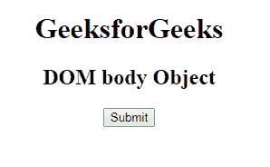
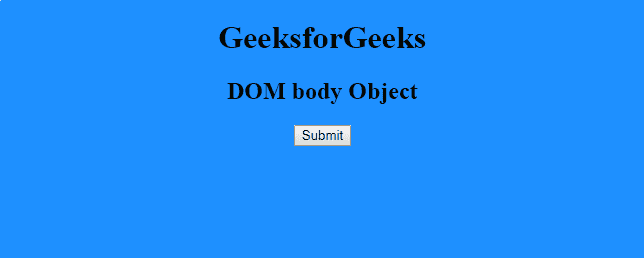
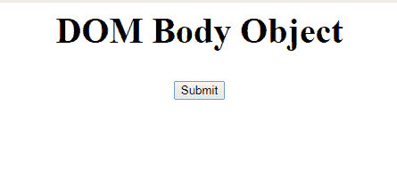
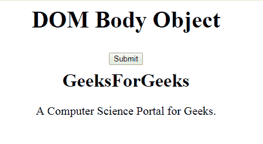

# HTML | DOM 正文对象

> 原文:[https://www.geeksforgeeks.org/html-dom-body-object/](https://www.geeksforgeeks.org/html-dom-body-object/)

**DOM 主体对象**用于表示 HTML <主体>元素。主体元素由 getElementByTagName()访问。也可以使用 **document.body** 对象进行访问。

**对象属性:**

*   **Alink:** 用于设置或返回文档中活动链接的颜色。
*   **背景:**用于设置或返回文档的背景图像。
*   **bgColor:** 用于设置或返回文档的 backgroundColor。
*   **链接:**用于设置或返回文档中未访问链接的颜色。
*   **文本:**用于设置或返回文档中文本的颜色。
*   **vLink:** 用于设置或返回文档中被访问链接的颜色。

**示例-1:**

## 超文本标记语言

```html
<!DOCTYPE html>
<html>

<head>
    <title>body tag</title>

    <!-- style on the body tag -->
    <style>
        body {
            text-align: center;
        }
    </style>
</head>

<!-- body tag starts from here -->

<body>
    <h1>GeeksforGeeks</h1>
    <h2>DOM body Object</h2>
    <button onclick="myGeeks()">Submit</button>
    <p id="sudo"></p>

    <script>
        function myGeeks() {
            var w = document.getElementsByTagName("BODY")[0];
            w.style.backgroundColor = "dodgerblue";
        }
    </script>
</body>

</html>
```

**输出:**
**点击按钮前:**



**点击按钮后:**



**示例-2:** 可以使用**文档.创建元素**方法创建身体对象。

## 超文本标记语言

```html
<!DOCTYPE html>
<html>

<head>
    <title>Body Object</title>
    <style>
        h2 {
            font-size: 40px;
        }

        .gfg {
            font-size: 30px;
            text-align: center;
        }

        h1 {
            text-align: center;
        }

        p {
            font-size: 20px;
            margin: 20px 0;
            text-align: center;
        }
    </style>
    <center>
        <H2>DOM Body Object</H2>
        <button onclick="myGeeks()">Submit</button>
        <script>
            function myGeeks() {
                var w = document.createElement("BODY");
                w.setAttribute("id", "GFG");
                document.body.appendChild(w);

                var heading = document.createElement("H1");
                var text1 = document.createTextNode("GeeksForGeeks");
                heading.appendChild(text1);
                document.getElementById("GFG").appendChild(heading);

                var para = document.createElement("P");
                var text2 =
                document.createTextNode("A Computer Science Portal"
                +" for Geeks.");
                para.appendChild(text2);
                document.getElementById("GFG").appendChild(para);
            }
        </script>

</head>

</html>                  
```

**点击按钮前:**



**点击按钮后:**



**支持的浏览器:****DOM Body Object**支持的浏览器如下:

*   谷歌 Chrome
*   微软公司出品的 web 浏览器
*   火狐浏览器
*   歌剧
*   旅行队