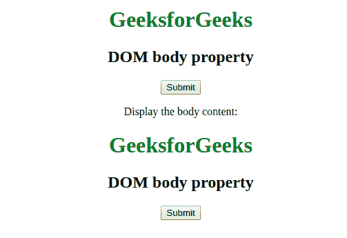
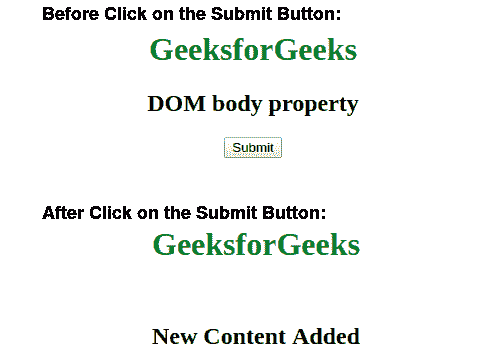

# HTML | DOM 正文属性

> 原文:[https://www.geeksforgeeks.org/html-dom-body-property/](https://www.geeksforgeeks.org/html-dom-body-property/)

**HTML DOM Body 属性**用于设置文档< body >元素。它只返回存在于<正文>标签中的内容。此属性用于更改<主体>元素内的当前内容，并用新的指定内容设置它们。该属性不返回< HTML >元素。
**语法:**

*   该语法返回 body 属性。

```html
document.body
```

*   此语法用于设置 body 属性。

```html
document.body = Content
```

**返回值:**对身体对象的引用，表示<身体>元素

**属性值:****文档. body 属性**使用单值*内容*，用于在 body 元素中添加新内容。
**例 1:**

## 超文本标记语言

```html
<!DOCTYPE html>
<html>
    <head>
        <title>DOM body property</title>
        <style>
            body {
                text-align:center;
            }
            h1 {
                color:green;
            }
        </style>
    </head>
    <body>
        <h1>GeeksforGeeks</h1>
        <h2>DOM body property</h2>
        <button onclick="geeks()">Submit</button>
        <p id = "gfg"></p>

        <script>
            function geeks() {
                var x = document.body.innerHTML;
                document.getElementById("gfg").innerHTML =
                "Display the body content:<br>" + x;
            }
        </script>
    </body>
</html>                   
```

**输出:**

**点击按钮前:**


**点击按钮后:**



**例 2:**

## 超文本标记语言

```html
<!DOCTYPE html>
<html>
    <head>
        <title>DOM body property</title>
        <style>
            h1 {
                color:green;
            }
            body {
                text-align:center;
            }
        </style>
    </head>
    <body>
        <h1>GeeksforGeeks</h1>
        <h2>DOM body property</h2>
        <button onclick="geeks()">Submit</button>
        <script>
            function geeks() {
                document.body.innerHTML = "<h1>"
                + "GeeksforGeeks"
                + "</h1>" + "<br>" + "<h2>"
                + "New Content Added"
                + "</h2>";
            }
        </script>
    </body>
</html>                   
```

**输出:**



**支持的浏览器:***DOM body 属性*支持的浏览器如下:

*   谷歌 Chrome
*   微软公司出品的 web 浏览器
*   火狐浏览器
*   歌剧
*   旅行队