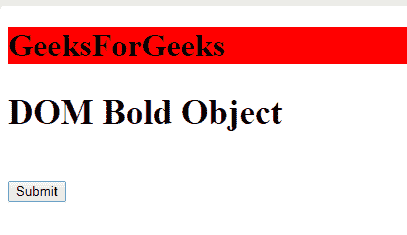
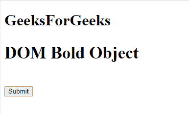
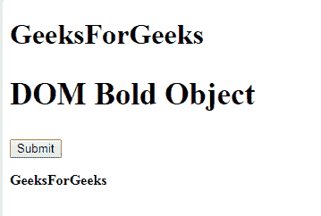

# HTML | DOM 加粗对象

> 原文:[https://www.geeksforgeeks.org/html-dom-bold-object/](https://www.geeksforgeeks.org/html-dom-bold-object/)

**DOM Bold** 对象用于表示 HTML < b >元素。粗体元素由 getElementById()访问。
**语法:**

```html
document.getElementById("ID");
```

其中“id”是分配给**“b”**标签的 ID。
**例-1:**

```html
<!DOCTYPE html>
<html>

<head>
    <title>
        HTML DOM Bold Object
    </title>

    <script>
        function myGeeks() {
            var b = document.getElementById("GFG");
            b.style.backgroundColor = "red";
        }
    </script>
</head>

<body>
    <b></b>
    <h1 id="GFG">GeeksForGeeks</h1></b>
    <h2 style="font-size:35px;">DOM Bold Object</h2>
    <BR>
    <button onclick="myGeeks()">
        Submit
    </button>

    <p id="geeks"></p>
</body>

</html>
```

**输出:**
**点击按钮前:**

**点击按钮后:**


**示例-2:** 可以使用**文档.创建元素**方法创建粗体对象。

```html
<!DOCTYPE html>
<html>

<head>
    <title>
        HTML DOM Bold Object
    </title>

    <!-- script for  Bold Object -->
    <script>
        function myGeeks() {
            var G = document.createElement("B");
            var F = 
            document.createTextNode("GeeksForGeeks");
            G.appendChild(F);
            document.body.appendChild(G);
        }
    </script>
</head>

<body>
    <H1>GeeksForGeeks</H1>
    <h2>DOM Bold Object</h2>

    <button onclick="myGeeks()">
        Submit
    </button>

    <p id="sudo"></p>

</body>

</html>                  
```

**输出:**
**点击按钮前:**

**点击按钮后:**

**支持的浏览器:**支持的浏览器 **DOM Bold Object** 如下:

*   谷歌 Chrome
*   微软公司出品的 web 浏览器
*   火狐浏览器
*   歌剧
*   旅行队