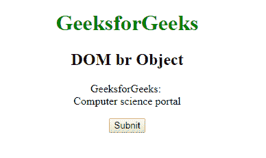
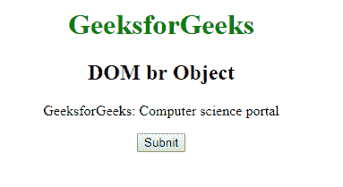
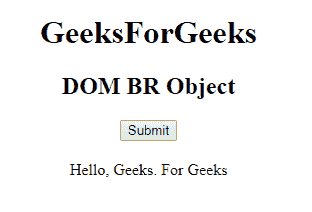
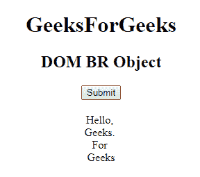

# HTML | DOM BR 对象

> 原文:[https://www.geeksforgeeks.org/html-dom-br-object/](https://www.geeksforgeeks.org/html-dom-br-object/)

**DOM BR 对象**用于表示 H [TML < br >元素。](https://www.geeksforgeeks.org/html-br-tag/)通过 **getElementById()** 访问 **br** 元素。
**语法:**

```html
getElementById(id)
```

其中“id”是分配给 **br** 标签的 ID。
**属性**

*   **清除:**用于设置或返回浮动对象周围的文本流

**示例-1:**

## 超文本标记语言

```html
<!DOCTYPE html>
<html>

<head>
    <title>br Tag</title>
    <style>
        body {
            text-align: center;
        }

        h1 {
            color: green;
        }
    </style>
</head>

<body>
    <h1>GeeksforGeeks</h1>
    <h2>DOM br Object</h2>

    <!-- br tag is used here -->

<p>GeeksforGeeks:
        <br id="GFG"> Computer science portal</p>

    <button onclick="myGeeks()">Subnit</button>
    <script>
        function myGeeks() {
            var w = document.getElementById("GFG");
            w.style.display = "none";
        }
    </script>
</body>

</html>
```

**输出:**
**点击按钮前:**



**点击按钮后:**



**示例-2:** Br 可以使用**文档.创建元素**方法创建对象。

## 超文本标记语言

```html
<!DOCTYPE html>
<html>

<body>
    <center>
        <h1>GeeksForGeeks</h1>
        <h2>DOM BR Object</h2>
        <button onclick="Geeks()" style="margin-bottom:20px;">
          Submit
        </button>

        <div id="GFG">
            <span>Hello, </span>
            <span>Geeks.</span>
            <span>For</span>
            <span>Geeks</span>
        </div>

        <script>
            function Geeks() {
                <!-- Get the div element with id="GFG" -->
                var g = document.getElementById("GFG");

                <!-- Get all span elements inside of div. -->
                var f = g.getElementsByTagName("SPAN");

                <!-- Create a loop which will insert a br
                     element before each span element in div,
                     starting from the second span element. -->

                var j;
                for (j = 1; j < f.length; j++) {
                    var w = document.createElement("BR");
                    g.insertBefore(w, f[j]);
                }
            }
        </script>
  </center>

</body>

</html>
```

**输出:**
**点击按钮前:**



**点击按钮后:**



**支持的浏览器:***DOM Br 对象*支持的浏览器如下:

*   谷歌 Chrome
*   微软公司出品的 web 浏览器
*   火狐浏览器
*   歌剧
*   旅行队