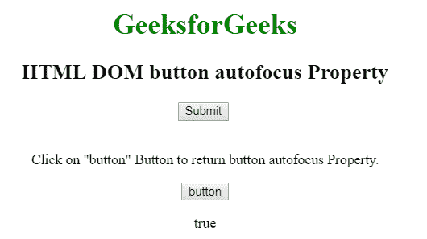

# HTML | DOM 按钮自动对焦属性

> 原文:[https://www . geesforgeks . org/html-DOM-button-autofocus-property/](https://www.geeksforgeeks.org/html-dom-button-autofocus-property/)

HTML DOM 中的**按钮自动对焦属性**用于设置或返回页面加载时按钮是否应该对焦。此属性用于反映 HTML 自动对焦属性。

**语法:**

*   它用于返回自动对焦属性。

    ```html
    buttonObject.autofocus
    ```

*   It is used to set the autofocus property.

    ```html
    buttonObject.autofocus = true|false
    ```

    **属性值:**

    *   **true:** 定义按钮元素获得焦点。
    *   **false:** 为默认值。它定义了按钮元素不能获得焦点。

    **返回值:**返回一个布尔值，代表获取自动对焦按钮元素，否则返回假。

    **示例:**本示例返回按钮自动对焦值。

    ```html
    <!DOCTYPE html> 
    <html> 

    <head> 
        <title>
            HTML DOM button autofocus Property 
        </title> 
    </head> 

    <body style="text-align:center"> 

        <h1 style="color: green;"> 
            GeeksforGeeks 
        </h1> 

        <h2>
            HTML DOM button autofocus Property
        </h2> 

        <!-- Assign id to the Button. -->
        <button id="GFG" autofocus>
            Submit
        </button>

        <br><br> 

        <p>
            Click on "button" Button to return
            button autofocus Property.
        </p>

        <button onclick="Geeks()">
            button
        </button> 

        <p id="sudo"></p> 

        <!-- Script to return button autofocus value -->
        <script> 
            function Geeks() { 

                // Return Boolean value to represent Button. 
                var x = document.getElementById("GFG").autofocus; 
                document.getElementById("sudo").innerHTML = x; 
            } 
        </script> 
    </body> 

    </html>                    
    ```

    **输出:**
    **点击按钮前:**
    
    **点击按钮后:**
    

    **支持的浏览器:**T2 DOM 按钮自动对焦属性支持的浏览器如下:

    *   谷歌 Chrome
    *   Internet Explorer 10.0
    *   火狐浏览器
    *   歌剧
    *   旅行队