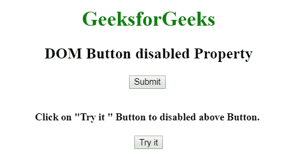
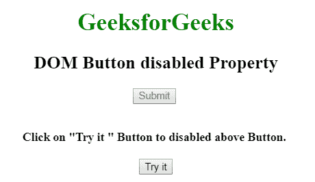
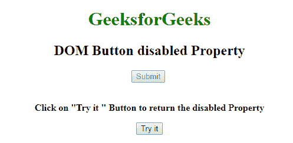
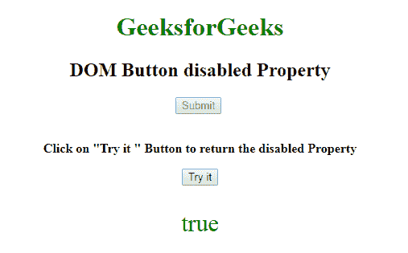

# HTML | DOM 按钮禁用属性

> 原文:[https://www . geesforgeks . org/html-DOM-button-disabled-property/](https://www.geeksforgeeks.org/html-dom-button-disabled-property/)

HTML DOM 中的**按钮禁用属性**用于设置或返回按钮元素是否被禁用。禁用的元素不可点击且不可用。它包含一个布尔值。

**语法:**

*   它用于返回按钮禁用属性。

    ```html
    buttonObject.disabled
    ```

*   It is used to set the button disabled property.

    ```html
    buttonObject.disabled = true|false
    ```

    **属性值:**

    *   **true:** 定义按钮元素被禁用。
    *   **False:** 为默认值。它定义了不禁用按钮。

    **返回值:**返回一个布尔值，代表按钮是否被禁用。

    示例 1:此示例说明如何设置按钮禁用属性。

    ```html
    <!DOCTYPE html> 
    <html> 

    <head> 
        <title>
            HTML DOM button disabled Property 
        </title> 
    </head> 

    <body style="text-align:center"> 

        <h1 style="color: green;"> 
            GeeksforGeeks 
        </h1> 

        <h2>DOM Button disabled Property</h2> 

        <!-- Assigning id to Button. -->
        <button id="GFG" onclick="hello()">
            Submit
        </button>

        <br><br> 

        <p id="sudo"></p>

        <b>
            Click on "Try it " Button to
            disabled above Button.
        </b> 

        <br><br>

        <button onclick="Geeks()">
            Try it
        </button>

        <script> 
            function Geeks() { 

                // change Boolean value to represent Button
                document.getElementById("GFG").disabled = "true";
            } 
        </script> 
    </body> 

    </html>                    
    ```

    **输出:**
    **之前点击【试试看】按钮:**
    
    **之后点击【试试看】按钮:**
    

    **示例 2:** 此示例说明如何返回禁用的属性。

    ```html
    <!DOCTYPE html> 
    <html> 

    <head> 
        <title>
            HTML DOM button disabled Property 
        </title> 
    </head> 

    <body style="text-align:center"> 

        <h1 style="color: green;"> 
            GeeksforGeeks 
        </h1> 

        <h2>DOM Button disabled Property</h2> 

        <!-- Assigning id to Button. -->
        <button id="GFG" disabled>
            Submit
        </button>

        <br><br> 

        <b>
            Click on "Try it " Button to 
            return the disabled Property
        </b> 

        <br><br>

        <button onclick="Geeks()">
            Try it
        </button>

        <p id="sudo" style="font-size:30px;color:green;"></p>

        <!-- script to return Button disabled Property value -->
        <script> 
            function Geeks() { 

                // return Boolean value to represent Button
                var x = document.getElementById("GFG").disabled;
                document.getElementById("sudo").innerHTML = x;
            } 
        </script> 
    </body> 

    </html>                    
    ```

    **输出:**
    **点击按钮前:**
    
    **点击按钮后:**
    

    **支持的浏览器:**禁用属性的 *DOM 按钮支持的浏览器如下:*

    *   谷歌 Chrome
    *   微软公司出品的 web 浏览器
    *   火狐浏览器
    *   歌剧
    *   旅行队