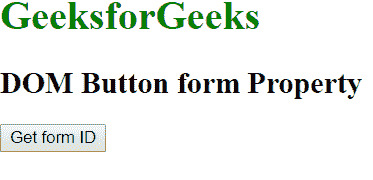

# HTML | DOM 按钮表单属性

> 原文:[https://www . geesforgeks . org/html-DOM-button-form-property/](https://www.geeksforgeeks.org/html-dom-button-form-property/)

HTML DOM 中的按钮表单属性用于返回包含按钮的表单的引用。它是只读属性，并在成功时返回表单对象。

**语法:**

```html
buttonObject.form
```

**返回值:**返回对包含按钮的表单元素的引用。如果按钮不在表单中，它将返回空值。

**示例:**此示例显示了按钮表单属性的工作方式:

```html
<!DOCTYPE html> 
<html> 

<head> 
    <title> 
        HTML DOM Button form Property 
    </title> 
</head> 

<body> 
    <h1 style = "color:green">GeeksforGeeks</h1> 

    <h2>DOM Button form Property</h2> 

    <form id="users"> 
        <button onclick = "myGeeks()" id ="btn" type="button"> 
            Get form ID 
        </button> 
    </form> 

    <p id = "GFG"></p> 

    <!-- Script to get the form ID -->
    <script> 
        function myGeeks() { 
            var x = document.getElementById("btn").form.id;
            document.getElementById("GFG").innerHTML = x;
        } 
    </script> 
</body> 

</html>                    
```

**输出:**

*   **点击按钮前:**
    
*   **点击按钮后:**
    

**支持的浏览器:**HTML DOM 按钮表单属性支持的浏览器如下:

*   谷歌 Chrome
*   微软公司出品的 web 浏览器
*   Mozilla Firefox
*   旅行队
*   歌剧