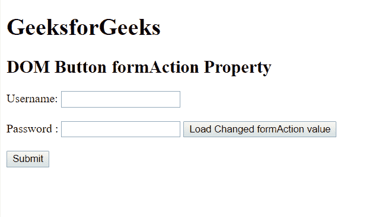
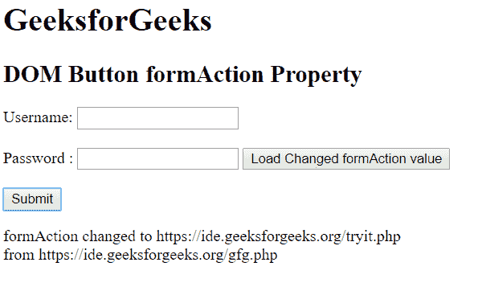

# HTML | DOM 按钮表单属性

> 原文:[https://www . geesforgeks . org/html-DOM-button-formaction-property/](https://www.geeksforgeeks.org/html-dom-button-formaction-property/)

HTML DOM 中的**按钮形式属性**用于**设置**或**返回** *按钮的形式属性*的值。提交表单后，会调用 formAction 属性。表单数据将在表单提交后发送到服务器。

**语法:**

*   它用于返回 formAction 属性。

    ```html
    buttonObject.formAction
    ```

*   它用于设置 formAction 属性。

    ```html
    buttonObject.formAction = URL
    ```

**属性值:**
**URL:** 用于指定表单提交后要发送数据的文档的 URL。
该网址的可能值为:

*   绝对 URL:它指向一个页面的完整地址。例如 www.gfg.org
*   相对 URL:用于指向网页内的文件。例如 www.geeksforgeeks.org

**返回值:**返回一个代表表单网址的字符串值。

**示例:**这个示例描述了如何设置和获取 formAction 属性的值。

```html
<!DOCTYPE html>
<html>

<head>
    <title>
        HTML DOM Button formAction Property
    </title>
</head>

<body>
    <h1>GeeksforGeeks</h1>

    <h2>DOM Button formAction Property</h2>

    <form action="/gfg.php" 
          method="post" 
          id="users">

        <label for="username">
          Username:
      </label>
        <input type="text" 
               name="username" 
               id="Username">

        <br>
        <br>

        <label for="password">
          Password: 
      </label>
        <input type="password" 
               name="password">

        <button id="btn" 
                type="submit"
                formaction="/tryit.php">
            Load Changed formAction value
      </button>
    </form>

    <br>

    <button onclick="myGeeks()">
        Submit
    </button>

    <p id="GFG"></p>

    <!-- script to get the updated action page -->
    <script>
        function myGeeks() {
            var x = 
                document.getElementById("btn").formAction;
            var y = 
                document.getElementById("users").action;
            document.getElementById("GFG").innerHTML = 
              "formAction changed to " + x + "<br> from " + y;
        }
    </script>
</body>

</html>
```

**输出:**
**点击按钮前:**


**点击按钮后:**


**支持的浏览器:****DOM 按钮表单属性**支持的浏览器如下:

*   谷歌 Chrome
*   Internet Explorer 10.0
*   火狐浏览器
*   苹果 Safari
*   歌剧