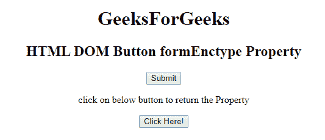
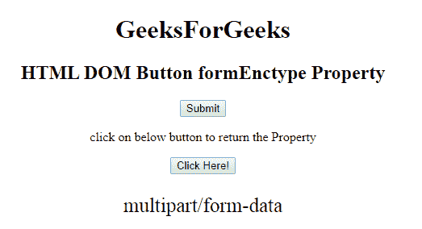
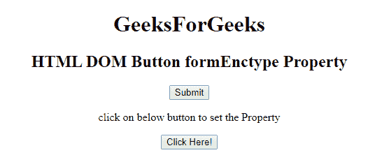
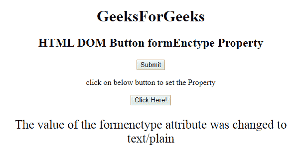

# HTML | DOM 按钮表单类型属性

> 原文:[https://www . geesforgeks . org/html-DOM-button-formenctype-property/](https://www.geeksforgeeks.org/html-dom-button-formenctype-property/)

**HTML DOM 按钮表单类型属性**用于设置或返回按钮元素中*表单类型*属性的值。此属性指定将呈现在表单中的数据在提交给服务器时应该被编码。只有在*方法=“开机自检”*的情况下，才能使用这种类型的属性。它覆盖了<表单>元素的 enctype 属性。

**语法:**

*   它返回 formEnctype 属性。

    ```html
    ButtonObject.formEnctype
    ```

*   它用于设置 formEnctype 属性。

    ```html
    ButtonObject.formEnctype = "application/x-www-form-urlencoded,
             multipart/form-data, text/plain"
    ```

**属性值:**

*   **application/x-www-form-URL encoded:**为默认值。它在发送到服务器之前对所有字符进行编码。它将空格转换成+符号，将特殊字符转换成十六进制值。
*   **多部分/表单数据:**不编码任何字符。
*   **text/plain:** This value convert spaces into + symbols but special characters are not converted.

    **返回值:**它返回一个字符串值，代表表单数据发送到服务器时的编码类型。

    **示例 1:** 这个示例说明了如何返回 Button formEnctype 属性。

    ```html
    <!DOCTYPE html>
    <html>

    <head>
        <title>
            HTML DOM Button formEnctype Property
        </title>
    </head>

    <body style="text-align:center;">
        <h1> 
            GeeksForGeeks 
        </h1>

        <h2> 
            HTML DOM Button formEnctype Property 
        </h2>

        <form action="#" method="get" target="_self">
            <button type="submit"
                    id="Geeks"
                    name="myGeeks"
                    value="Submit @ geeksforgeeks"
                    formenctype="multipart/form-data"
                    formTarget="_blank"
                    Formnovalidate>
                Submit </button>
        </form>

        <p>
            click on below button to return the Property
        </p>

        <button onclick="myGeeks()">
            Click Here!
        </button>

        <p id="GFG" style="font-size:25px;"></p>

        <!-- Script to return formEnctype Property -->
        <script>
            function myGeeks() {
                var btn = document.getElementById("Geeks").formEnctype;
                document.getElementById("GFG").innerHTML = btn;
            }
        </script>
    </body>

    </html>
    ```

    **输出:**
    **点击按钮前:**
    

    **点击按钮后:**
    

    **示例 2:** 本示例说明如何设置 Button formEnctype 属性。

    ```html
    <!DOCTYPE html>
    <html>

    <head>
        <title>
            HTML DOM Button formEnctype Property
        </title>
    </head>

    <body style="text-align:center;">
        <h1> 
            GeeksForGeeks 
        </h1>

        <h2> 
            HTML DOM Button formEnctype Property 
        </h2>

        <form action="#" method="get" target="_self">
            <button type="submit"
                    id="Geeks" 
                    name="myGeeks"
                    value="Submit @ geeksforgeeks"
                    formenctype="multipart/form-data"
                    formTarget="_blank" 
                    Formnovalidate>
                Submit </button>
        </form>

        <p>
            click on below button to set the Property
        </p>

        <button onclick="myGeeks()">
            Click Here!
        </button>

        <p id="GFG" style="font-size:25px;"></p>

        <!-- Script to return formEnctype Property -->
        <script>
            function myGeeks() {
                var btn = document.getElementById(
                  "Geeks").formEnctype = "text/plain";

                document.getElementById("GFG").innerHTML = 
                  "The value of the formenctype attribute" +
                  " was changed to " + btn;
            }
        </script>
    </body>

    </html>
    ```

    **输出:**
    **点击按钮前:**
    

    **点击按钮后:**
    

    **支持的浏览器:****HTML DOM 按钮表单类型属性**支持的浏览器如下:

    *   谷歌 Chrome
    *   微软公司出品的 web 浏览器
    *   火狐浏览器
    *   苹果 Safari
    *   歌剧