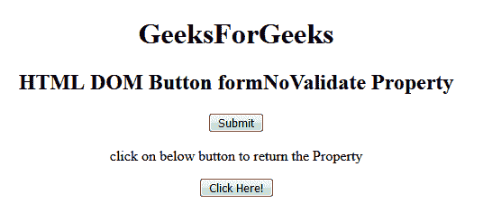
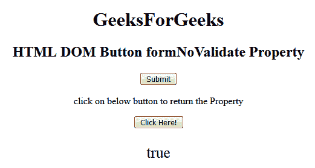
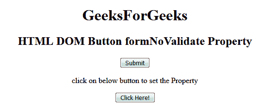
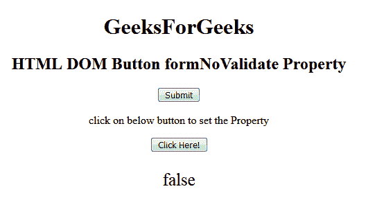

# HTML | DOM 按钮表单合并属性

> 原文:[https://www . geesforgeks . org/html-DOM-button-formnovalidate-property/](https://www.geeksforgeeks.org/html-dom-button-formnovalidate-property/)

HTML DOM 中的**按钮 formNoValidate 属性**用于在提交表单时设置或返回表单数据是否需要验证。此属性用于反映 HTML formnovalidate 属性。

**语法:**

*   它返回 formNoValidate 属性。

    ```html
    buttonObject.formNoValidate
    ```

*   它用于设置 formNoValidate 属性。

    ```html
    button.formNoValidate = true|false
    ```

**属性值:**

*   **true:** 指定表单数据不应该被验证。
*   **false:** 为默认值。它指定应该验证的表单数据。

**返回值:**如果不应该验证表单数据，则返回布尔值 true，否则返回 false。

**示例 1:** 此示例说明了 HTML DOM Button formNoValidate 属性。

```html
<!DOCTYPE html> 
<html> 

<head> 
    <title> 
        HTML DOM  Button formNoValidate Property 
    </title> 
</head> 

<body style="text-align:center;"> 
    <h1> 
        GeeksForGeeks 
    </h1> 

    <h2> 
        HTML DOM Button formNoValidate Property 
    </h2> 

    <form action="#" method="get" target="_self"> 
        <button type = "submit" id = "Geeks" name="myGeeks"
            value = "Submit @ geeksforgeeks"
            formTarget="_blank" Formnovalidate> 
    Submit </button>
    </form> 

    <p> 
        click on below button to return the Property 
    </p> 

    <button onclick = "myGeeks()"> 
        Click Here! 
    </button> 

    <p id = "GFG"style="font-size:25px;"></p> 

    <!-- Script to return submit formnovalidate Property -->
    <script> 
        function myGeeks() { 
            var btn = document.getElementById("Geeks").formNoValidate; 
            document.getElementById("GFG").innerHTML = btn; 
        } 
    </script> 
</body> 

</html>                     

```

*   **点击按钮前:**
    
*   **点击按钮后:**
    

**示例 2:** 本示例说明如何设置 Button formNoValidate 属性。

```html
<!DOCTYPE html> 
<html> 

<head> 
    <title> 
        HTML DOM  Button formNoValidate Property 
    </title> 
</head> 

<body style="text-align:center;"> 
    <h1> 
        GeeksForGeeks 
    </h1> 

    <h2> 
        HTML DOM Button formNoValidate Property 
    </h2> 

    <form action="#" method="get" target="_self"> 
        <button type = "submit" id = "Geeks" name="myGeeks"
            value = "Submit @ geeksforgeeks"
            formTarget="_blank" Formnovalidate> 
    Submit </button>
    </form> 

    <p> 
        click on below button to return the Property 
    </p> 

    <button onclick = "myGeeks()"> 
        Click Here! 
    </button> 

    <p id = "GFG"style="font-size:25px;"></p> 

    <!-- Script to return submit formnovalidate Property -->
    <script> 
        function myGeeks() { 
            var btn = document.getElementById("Geeks").formNoValidate
                     = "false"; 

            document.getElementById("GFG").innerHTML = btn; 
        } 
    </script> 
</body> 

</html>                     
```

*   **点击按钮前:**
    
*   **点击按钮后:**
    