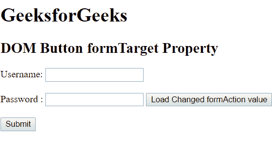
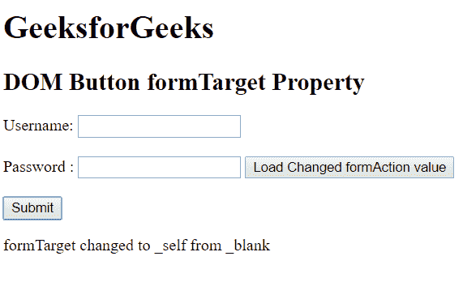

# HTML | DOM 按钮表单目标属性

> 原文:[https://www . geesforgeks . org/html-DOM-button-formtarget-property/](https://www.geeksforgeeks.org/html-dom-button-formtarget-property/)

HTML DOM 中的 Button formTarget 属性用于设置或返回按钮的 formTarget 属性的值。提交表单后，将调用 formTarget 属性。表单数据将在表单提交后发送到服务器。

**语法:**

*   它用于返回 formTarget 属性。

    ```html
    buttonObject.formTarget
    ```

*   它用于设置 formTarget 属性。

    ```html
    buttonObject.formTarget = "_blank | _parent | _self | _top | framename"
    ```

**属性值:**

*   **_blank:** 用于在新窗口/标签中加载响应。
*   **_parent:** 用于加载父帧中的响应。
*   **_self:** 为默认值，用于加载同一帧的响应。
*   **_top:** 用于将响应加载到窗口的整个主体中。
*   **framename:** 用于在命名的 iframe 中加载响应。

**返回值:**返回一个字符串值，代表必须提交响应的地方。

**示例:**这个示例描述了如何设置和获取 formTarget 属性的值。

```html
<!DOCTYPE html> 
<html> 

<head> 
    <title> 
        HTML DOM Button formTarget Property 
    </title> 
</head> 

<body> 
    <h1>GeeksforGeeks</h1> 

    <h2>DOM Button formTarget Property</h2> 

    <form action="/gfg.php" method="post" id="users"> 

        <label for="username">Username:</label> 
        <input type="text" name="username" id="Username"> 

        <br><br> 

        <label for="password">Password :</label> 
        <input type="password" name="password"> 

        <button id="btn" type="submit" formtarget="_blank">
            Load Changed formAction value</button>
    </form> 

    <br> 

    <button onclick = "myGeeks()"> 
        Submit 
    </button> 

    <p id = "GFG"></p> 

    <!-- script to set and get the value of formTarget attribute -->
    <script> 
    function myGeeks() { 
        var x = document.getElementById("btn").formTarget ;
                var y = document.getElementById("btn").formTarget = "_self";
        document.getElementById("GFG").innerHTML 
            = "formTarget changed to " + y  + "<br> from "+ x ; 
    } 
    </script> 
</body> 

</html>                                     
```

**输出:**
**点击按钮前:**


**点击按钮后:**


**支持的浏览器:**

1.  Internet Explorer 10.0
2.  谷歌 Chrome
3.  Mozilla Firefox
4.  歌剧
5.  旅行队