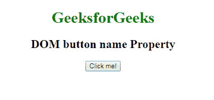
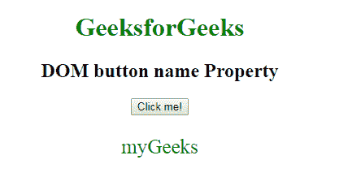
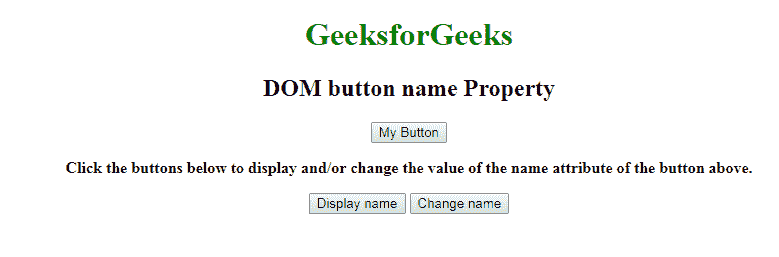
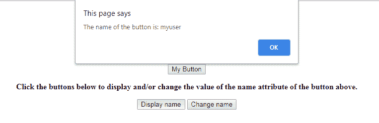
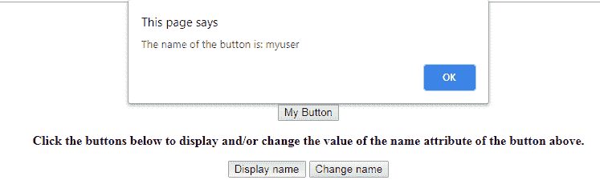

# HTML | DOM 按钮名称属性

> 原文:[https://www . geesforgeks . org/html-DOM-button-name-property/](https://www.geeksforgeeks.org/html-dom-button-name-property/)

**DOM 按钮名称**属性用于**设置**或**返回**按钮元素名称属性的值。name 属性用于指定按钮的名称，当用户提交表单数据时，该属性用于引用表单数据。它还引用了 javascript 中的元素。

**语法:**

*   它用于返回 name 属性。

    ```html
    buttonObject.name
    ```

*   它用于设置 name 属性。

    ```html
    buttonObject.name = name
    ```

**属性值**

*   **名称:**指定按钮的名称。

**返回值**返回一个代表按钮名称的字符串值。

**示例-1:** 这个程序演示了如何返回属性名称。

```html
<!DOCTYPE html>
<html>

<head>
    <title>DOM button name Property</title>
</head>

<body style="text-align:center">
    <h1 style="color:green;"> 
            GeeksforGeeks 
        </h1>

    <h2> 
            DOM button name Property 
        </h2>
    <button id="btn" name="myGeeks" onclick="geek()">
        Click me!</button>

    <p id="g" style="font-size:25px;color:green;"></p>

    <script>
        function geek() {

            // Return name value.
            var x = document.getElementById("btn").name;
            document.getElementById("g").innerHTML = x;
        }
    </script>
</body>

</html>
```

**输出:**

**点击按钮前:**


**点击按钮后:**


**示例-2:** 该程序说明了如何显示和更改名称属性。

```html
<!DOCTYPE html>
<html>

<head>
    <title>DOM button name Property</title>
</head>

<body style="text-align:center">
    <h1 style="color:green;"> 
            GeeksforGeeks 
        </h1>

    <h2> 
            DOM button name Property 
        </h2>

    <body>

        <button id="GFG" name="myuser">My Button
      </button>

        <b>
          <p>
         Click the buttons below to display and/or
            change the value of the name attribute 
            of the button above.
          </p>
      </b>

<button onclick="display()">
  Display name
      </button>
<button onclick="change()">
  Change name
      </button>

<script>
function display() {
  var x = document.getElementById("GFG").name;
  alert("The name of the button is: " + x);
}

function change() {

  // Set button name value.
  var x = document.getElementById("GFG").name = 
      "GeeksForGeeks";
  alert ("The name was changed to: " + x);
}
</script>

</body>
</html>
```

**输出:**

**最初:**


**点击显示按钮前:**


**点击变更按钮后:**


**支持的浏览器:**T2 DOM 按钮名称属性支持的浏览器如下:

*   谷歌 Chrome
*   微软公司出品的 web 浏览器
*   火狐浏览器
*   歌剧
*   旅行队