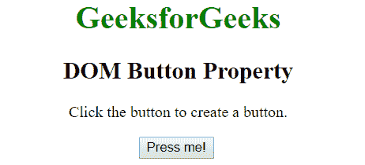
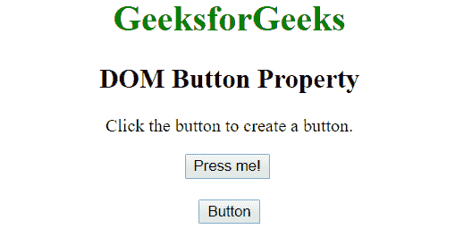
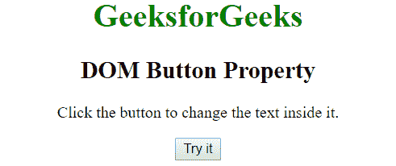
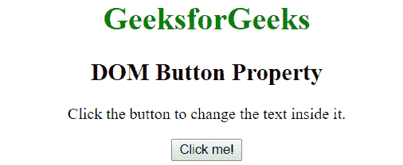

# HTML | DOM 按钮对象

> 原文:[https://www.geeksforgeeks.org/html-dom-button-object/](https://www.geeksforgeeks.org/html-dom-button-object/)

HTML 中的按钮对象用来表示一个<button>元素。getElementById()方法用于获取按钮对象。
**创建按钮对象:**按钮对象可以使用 JavaScript 创建。document.createElement()方法用于创建<按钮>元素。创建按钮对象后，使用 appendChild()方法追加特定元素(如 div)以显示它。
**例 1:**</button> 

## 超文本标记语言

```html
<!DOCTYPE html>
<html>
    <head>
        <title>
            DOM Button Object
        </title>

        <!-- script to create new button -->
        <script>
            function Geeks() {
                var myDiv = document.getElementById("GFG");

                // creating button element
                var button = document.createElement('BUTTON');

                // creating text to be
                //displayed on button
                var text = document.createTextNode("Button");

                // appending text to button
                button.appendChild(text);

                // appending button to div
                myDiv.appendChild(button); ;
            }
        </script>
    </head>

    <body style = "text-align: center;">

        <h1 style = "color:green;">
            GeeksforGeeks
        </h1>

        <h2>
            DOM Button Property
        </h2>

<p>Click the button to create a button.</p>

        <button onclick = "Geeks()">
            Press me!
        </button>

        <br><br>

        <div id = "GFG"></div>
    </body>
</html>                   
```

**输出:**
**之前点击按钮:**



**点击按钮后:**



**访问按钮对象:**使用 getElementById()方法访问按钮对象。将按钮元素的 id 放在 getElementById()中进行访问。
**例 2:**

## 超文本标记语言

```html
<!DOCTYPE html>
<html>
    <head>
        <title>
            DOM Button Object
        </title>

        <script>
        function geek() {

            // Accessing the button element
            // by using id attribute
            var doc = document.getElementById("btn");

            // Changing the text content
            doc.textContent = "Click me!";
        }
        </script>
    </head>

    <body style = "text-align: center;">

        <h1 style = "color:green;">
            GeeksforGeeks
        </h1>

        <h2>
            DOM Button Property
        </h2>

<p>
            Click the button to change the
            text inside it.
        </p>

        <button type = "button" id = "btn"
            onclick = "geek()">
            Try it
        </button>
    </body>
</html>                   
```

**输出:**
**之前点击按钮:**



**点击按钮后:**



**支持的浏览器:**

*   谷歌 Chrome
*   微软公司出品的 web 浏览器
*   火狐浏览器
*   歌剧
*   旅行队