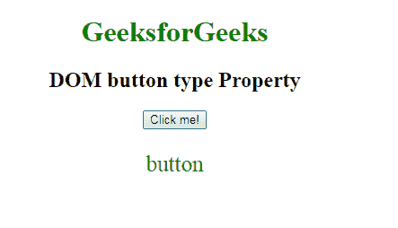

# HTML | DOM 按钮类型属性

> 原文:[https://www . geesforgeks . org/html-DOM-button-type-property/](https://www.geeksforgeeks.org/html-dom-button-type-property/)

**DOM 按钮类型**属性用于设置或返回<按钮>元素的类型属性的值。

**语法:**

*   它用于返回类型属性。

    ```html
    buttonObject.type
    ```

*   它用于设置类型属性。

    ```html
    buttonObject.type = "submit|button|reset"
    ```

**属性值:**

*   **提交:**定义一个提交按钮。除了 Internet Explorer 之外，它对所有浏览器都有默认值。
*   **按钮:**定义一个可点击的按钮。它有一个互联网浏览器的默认值。
*   **复位:**定义了一个复位按钮，用于改变表单中之前的数据。

**返回值**:返回代表按钮类型的字符串值。

**示例-1:** 演示如何返回 buttonObject.type 属性的 HTML 程序。

```html
<!DOCTYPE html> 
<html> 
    <head> 
        <title>DOM button type Property</title> 
    </head> 
    <body style = "text-align:center"> 
        <h1 style = "color:green;"> 
            GeeksforGeeks 
        </h1> 

        <h2> 
            DOM button type Property 
        </h2> 

        <button id="btn"type="Button" value="GeeksForGeeks" 
                                          onclick="geek()"> 
        Click me!</button> 

        <p id="g" style="font-size:25px;color:green;"></p> 

        <script> 
            function geek() { 
            var x = document.getElementById("btn").type; 
            document.getElementById("g").innerHTML =  x; 
            } 
        </script> 
    </body> 
</html> 
```

**输出:**
**点击按钮前:**

**点击按钮后::**

**示例-2 :** 说明如何设置 buttonObject.type 属性的示例。

```html
<!DOCTYPE html> 
<html> 
    <head> 
        <title>DOM button type Property</title> 
    </head> 
    <body style = "text-align:center"> 
        <h1 style = "color:green;"> 
            GeeksforGeeks 
        </h1> 

        <h2> 
            DOM button type Property 
        </h2> 
        <form id="myForm" action="/action_page.php">
       First name: <input type="text" name="fname"><br>
       Last name: <input type="text" name="lname"><br>
      <button id="btn" type="button" value="Submit">Submit</button>
      <br><br>
      <b>CLick on "Try it " Button to 
          change the type of above Button</b>
      <br><br>    
     <button  onclick="geek()"> 
        Try it</button> 

        <p id="g" style="font-size:25px;color:green;"></p> 

        <script> 
            function geek() { 
            var x = document.getElementById("btn").type = "submit"
            document.getElementById("g").innerHTML =  
             "The value of a type attribute of a button"
             + " was changed from button to " + x; 
            } 
        </script> 
    </body> 
</html> 
```

**输出:**

**点击按钮前:**

**点击按钮后:**


**支持的浏览器:**T2 DOM 按钮类型属性支持的浏览器如下:

*   谷歌 Chrome
*   微软公司出品的 web 浏览器
*   火狐浏览器
*   歌剧
*   旅行队