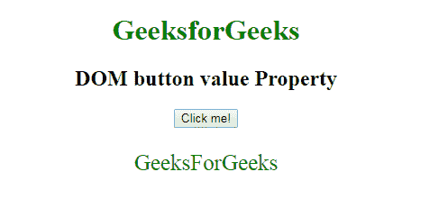

# HTML | DOM 按钮值属性

> 原文:[https://www . geesforgeks . org/html-DOM-button-value-property/](https://www.geeksforgeeks.org/html-dom-button-value-property/)

**DOM 按钮值**属性用于**设置**或**返回**按钮元素的值属性的值。HTML 中 **<按钮>** 元素的值属性用于指定按钮元素的初始值。

**语法:**

*   它用于返回 value 属性。

```html
buttonObject.value
```

*   它用于设置 value 属性。

```html
buttonObject.value = text
```

**属性值:**

*   **文本:**指定按钮的初始值。

**返回值:**返回代表按钮初始值的字符串值。

**示例-1:** 这个 Html 程序演示了如何返回属性值。

## 超文本标记语言

```html
<!DOCTYPE html>
<html>

<head>
    <title>DOM button value Property
    </title>

</head>

<body style="text-align:center">
    <h1 style="color:green;">
            GeeksforGeeks
        </h1>

    <h2>
            DOM button value Property
        </h2>

    <button id="btn"
            value="GeeksforGeeks"
            onclick="geek()">
        Click me!
    </button>

    <p id="g"
       style="font-size:25px;color:green;">
  </p>

    <script>
        function geek() {

            var x =
                document.getElementById("btn").value;
            document.getElementById("g").innerHTML =
                x;
        }
    </script>
</body>

</html>
```

**输出:**
**点击按钮前:**


**点击按钮后:**



**示例-2:** 这个 HTML 程序说明了如何设置 Property 值。

## 超文本标记语言

```html
<!DOCTYPE html>
<html>

<head>
    <title>DOM button value Property
  </title>
</head>

<body style="text-align:center">
    <h1 style="color:green;">
            GeeksforGeeks
        </h1>

    <h2>
            DOM button value Property
        </h2>

    <button id="btn"
            value="User"
            onclick="geek()">
        Click me!
  </button>

    <p id="g"
       style="font-size:25px;
              color:green;">
  </p>

    <script>
        function geek() {
            var x =
                document.getElementById("btn").value =
                "GeeksForGeeks"
            document.getElementById("g").innerHTML =
              "The value has been changed from user to " +
              x;
        }
    </script>
</body>

</html>
```

**输出:**
**点击按钮前:**


**点击按钮后:**


**支持的浏览器:**支持的浏览器 *DOM 按钮值*属性如下:

*   谷歌 Chrome
*   微软公司出品的 web 浏览器
*   火狐浏览器
*   歌剧
*   旅行队