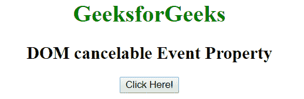
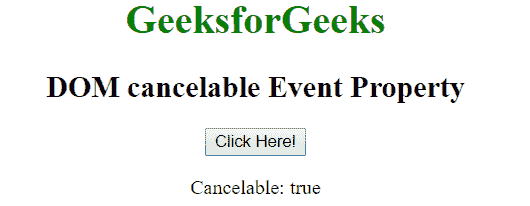

# HTML | DOM 可取消事件属性

> 原文:[https://www . geesforgeks . org/html-DOM-cancelable-event-property/](https://www.geeksforgeeks.org/html-dom-cancelable-event-property/)

**可取消事件**属性用于指示事件是否可以阻止其默认操作。如果可以阻止默认操作，则该值为真，否则该值为假。它是只读属性。
**语法:**

```html
event.cancelable
```

**返回值:**返回一个布尔值，表示事件是否可取消。

*   返回**真**，表示事件可取消。
*   返回**假**，表示事件不可取消。

**示例:**

```html
<!DOCTYPE html>
<html>

<head>
    <title>DOM cancelable Event Property</title>
</head>

<body style="text-align:center">

    <h1 style="color: green;">
        GeeksforGeeks
    </h1>

    <h2>
        DOM cancelable Event Property
    </h2>

    <button onclick="Geeks(event)">Click Here!</button>

    <p id="p"></p>

    <script>
        function Geeks(event) { 
            var x = event.cancelable;
            document.getElementById("p").innerHTML = 
                                    "Cancelable: " + x;
        }
    </script>
</body>
</html>                    
```

**输出:**
**点击按钮前:**

**点击按钮后:**

**支持的浏览器:**可取消事件属性支持的浏览器如下:

*   苹果 Safari
*   谷歌 Chrome
*   火狐浏览器
*   歌剧
*   微软公司出品的 web 浏览器