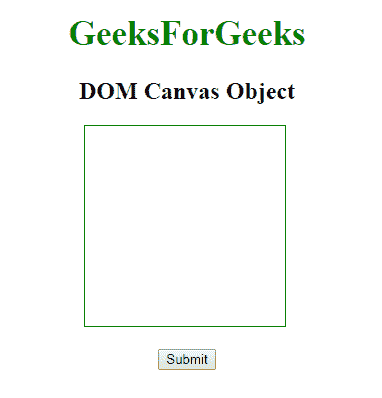
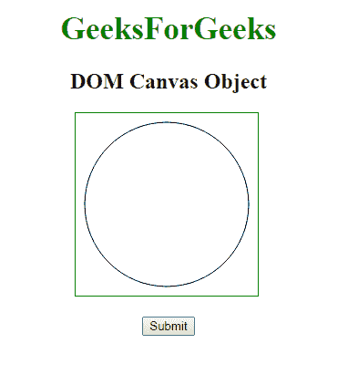
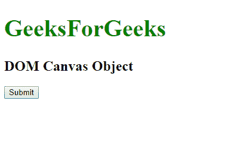
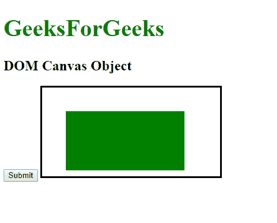

# HTML | DOM 画布对象

> 原文:[https://www.geeksforgeeks.org/html-dom-canvas-object/](https://www.geeksforgeeks.org/html-dom-canvas-object/)

**DOM 画布对象**用于表示 HTML <画布>元素。 **<画布>** 标签用于使用 javascript 在文档中绘制图形。它在 HTML5 中是新的。画布元素由 **getElementById()** 访问。

**语法:**

```html
accessed by getElementById("id"). 
```

其中“id”是分配给**画布**标签的 ID。

**示例-1:**

```html
<!DOCTYPE html>
<html>

<head>
    <title>canvas Tag</title>
</head>

<body>
    <center>
        <h1 style="color:green; Font-size:35px;" >
           GeeksForGeeks
        </h1>
        <h2>DOM Canvas Object</h2>

        <!-- canvas Tag starts here -->
        <canvas id="geeks" height="200" width="200" 
                style="border:1px solid green">
        </canvas>
        <!-- canvas Tag ends here -->

        <br>
        <br>

        <button onclick="myGeeks()">Submit</button>

      <script>
            function myGeeks() {

                var gfg = document.getElementById("geeks");

                var sudo = gfg.getContext("2d");
                sudo.beginPath();
                sudo.arc(100, 100, 90, 0, 2 * Math.PI);
                sudo.stroke();
            }
        </script>
</body>

</html>
```

**输出:**
**点击按钮前:**


**点击按钮后:**


**示例-2:** 可以使用 **document.createElement** 方法创建画布对象。

```html
<!DOCTYPE html>
<html>

<head>
    <style>
        canvas {
            border: 3px solid black;
        }
    </style>
</head>

<body>
    <h1 style = "color: green; font-size:40px;" >
      GeeksForGeeks
    </h1>
    <h2>DOM Canvas Object</h2>

    <button onclick="myGeeks()">
      Submit
    </button>

    <script>
        function myGeeks() {
            var geeks = document.createElement("CANVAS");
            var gfg = geeks.getContext("2d");
            gfg.fillStyle = "green";
            gfg.fillRect(40, 40, 200, 100);
            document.body.appendChild(geeks);
        }
    </script>

</body>

</html>
```

**输出:**
**点击按钮前:**


**点击按钮后:**


**支持的浏览器:****DOM 画布对象**支持的浏览器如下:

*   谷歌 Chrome
*   微软公司出品的 web 浏览器
*   火狐浏览器
*   歌剧
*   旅行队