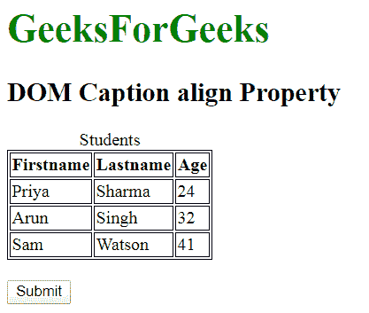
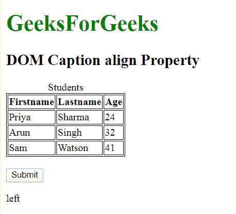
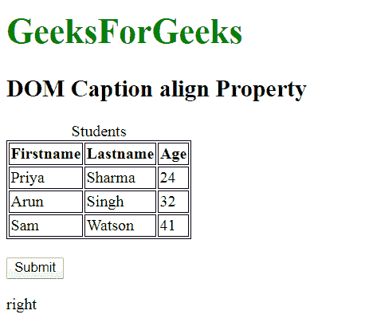

# HTML | DOM 标题对齐属性

> 原文:[https://www . geesforgeks . org/html-DOM-caption-align-property/](https://www.geeksforgeeks.org/html-dom-caption-align-property/)

**HTML DOM 标题对齐属性**用于设置或返回 **<标题>** 元素的对齐属性的值。

**语法:**

*   它返回标题对齐属性。

    ```html
    captionobject.align;
    ```

*   它设置标题对齐属性。

    ```html
    captionobject.align="left | right | center"
    ```

**属性值:**

*   **左:**设置左对齐字幕元素。
*   **居中:**设置居中对齐字幕元素。这是默认值。
*   **右:**设置向右对齐字幕元素。

**返回值:**返回一个字符串值，代表字幕元素的对齐方式。

**示例 1:** 本示例返回标题对齐属性。

```html
<!DOCTYPE html>
<html>

<head>
    <style>
        table,
        th,
        td {
            border: 1px solid black;
        }
    </style>
</head>

<body>
    <h1 style="color:green;font-size:35px;">
        GeeksForGeeks
    </h1>
    <h2>DOM Caption align Property</h2>

    <table>
        <caption id="GFG" align="left">Students</caption>
        <tr>
            <th>Firstname</th>
            <th>Lastname</th>
            <th>Age</th>
        </tr>
        <tr>
            <td>Priya</td>
            <td>Sharma</td>
            <td>24</td>
        </tr>
        <tr>
            <td>Arun</td>
            <td>Singh</td>
            <td>32</td>
        </tr>
        <tr>
            <td>Sam</td>
            <td>Watson</td>
            <td>41</td>
        </tr>
    </table>
    <br>
    <button onclick="myGeeks()">Submit</button>
    <p id="sudo"></p>
    <script>
        function myGeeks() {
            var w = document.getElementById("GFG").align;
            document.getElementById("sudo").innerHTML = w;
        } 
    </script>
</body>

</html>
```

**输出:**

*   **点击按钮前:**
    
*   **点击按钮后:**
    

**示例 2:** 本示例返回标题对齐属性。

```html
<!DOCTYPE html>
<html>

<head>
    <style>
        table,
        th,
        td {
            border: 1px solid black;
        }
    </style>
</head>

<body>
    <h1 style="color:green;font-size:35px;">
        GeeksForGeeks
    </h1>
    <h2>DOM Caption align Property</h2>

    <table>
        <caption id="GFG" align="left">
            Students
        </caption>

        <tr>
            <th>Firstname</th>
            <th>Lastname</th>
            <th>Age</th>
        </tr>
        <tr>
            <td>Priya</td>
            <td>Sharma</td>
            <td>24</td>
        </tr>
        <tr>
            <td>Arun</td>
            <td>Singh</td>
            <td>32</td>
        </tr>
        <tr>
            <td>Sam</td>
            <td>Watson</td>
            <td>41</td>
        </tr>
    </table>
    <br>
    <button onclick="myGeeks()">Submit</button>
    <p id="sudo"></p>

    <script>
        function myGeeks() {
            var w = document.getElementById(
                    "GFG").align = "right";

            document.getElementById(
                    "sudo").innerHTML = w;
        } 
    </script>
</body>

</html>
```

**输出:**

*   **点击按钮前:**
    
*   **点击按钮后:**
    

**支持的浏览器:****HTML DOM 标题对齐属性**支持的浏览器如下:

*   谷歌 Chrome
*   微软公司出品的 web 浏览器
*   火狐浏览器
*   苹果 Safari
*   歌剧