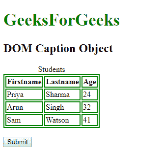
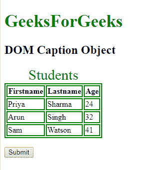
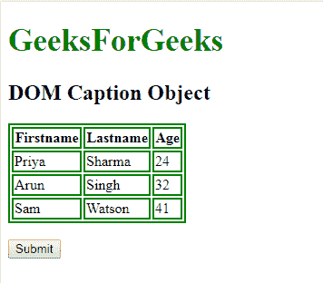
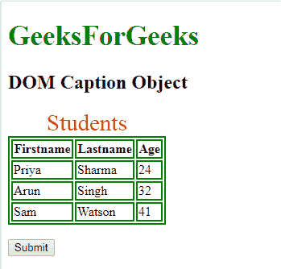

# HTML | DOM 标题对象

> 原文:[https://www.geeksforgeeks.org/html-dom-caption-object/](https://www.geeksforgeeks.org/html-dom-caption-object/)

**DOM 标题对象**用于表示 HTML <标题>元素(标题元素用于指定表格的标题)。标题元素由 getElementById()访问。
**属性:**

*   它有一个[](https://www.geeksforgeeks.org/html-dom-caption-align-property/?ref=rp)**对齐属性，用于设置或返回标题的对齐方式。**

****语法:**** 

```html
document.getElementById("id"); 
```

**其中“id”是分配给**标题**标签的 ID。
**示例-1:**** 

## **超文本标记语言**

```html
<!DOCTYPE html>
<html>

<head>
    <style>
        table,
        th,
        td {
            border: 1px solid black;
        }
    </style>
</head>

<body>
    <h1 style="color:green;font-size:35px;">
      GeeksForGeeks
    </h1>
    <h2>DOM Caption Object</h2>

    <table>
        <caption id="GFG">Students</caption>
        <tr>
            <th>Firstname</th>
            <th>Lastname</th>
            <th>Age</th>
        </tr>
        <tr>
            <td>Priya</td>
            <td>Sharma</td>
            <td>24</td>
        </tr>
        <tr>
            <td>Arun</td>
            <td>Singh</td>
            <td>32</td>
        </tr>
        <tr>
            <td>Sam</td>
            <td>Watson</td>
            <td>41</td>
        </tr>
    </table>
    <br>
    <button onclick="myGeeks()">Submit</button>

    <script>
        function myGeeks() {
            var w = document.getElementById("GFG");
            w.style.color = "green";
            w.style.fontSize = "28px";
        }
    </script>

</body>

</html>
```

****输出:**
**点击按钮前:**** 

****

****点击按钮后:**** 

****

****示例-2:** 可以使用 **document.createElement** 方法创建字幕对象。** 

## **超文本标记语言**

```html
<!DOCTYPE html>
<html>

<head>
    <style>
        table,
        th,
        td {
            border: 2px soliD green;
        }
    </style>
</head>

<body>
    <h1 style="color:green;font-size:35px;">
      GeeksForGeeks
    </h1>
    <h2>DOM Caption Object</h2>

    <table id="GFG">
        <tr>
            <th>Firstname</th>
            <th>Lastname</th>
            <th>Age</th>
        </tr>
        <tr>
            <td>Priya</td>
            <td>Sharma</td>
            <td>24</td>
        </tr>
        <tr>
            <td>Arun</td>
            <td>Singh</td>
            <td>32</td>
        </tr>
        <tr>
            <td>Sam</td>
            <td>Watson</td>
            <td>41</td>
        </tr>
    </table>
    <br>

    <button onclick="myGeeks()">
      Submit
    </button>

    <script>
        function myGeeks() {
            var cap = document.createElement("CAPTION");
            var txt = document.createTextNode("Students");
            cap.appendChild(txt);
            cap.style.color = "red";
            cap.style.fontSize = "29px";

            var tab = document.getElementById("GFG")
            tab.insertBefore(cap, tab.childNodes[0]);
        }
    </script>

</body>

</html>
```

****输出:**
**点击按钮前:**** 

****

****点击按钮后:**** 

****

****支持的浏览器:****DOM 字幕对象**支持的浏览器如下:** 

*   **谷歌 Chrome**
*   **微软公司出品的 web 浏览器**
*   **火狐浏览器**
*   **歌剧**
*   **旅行队**