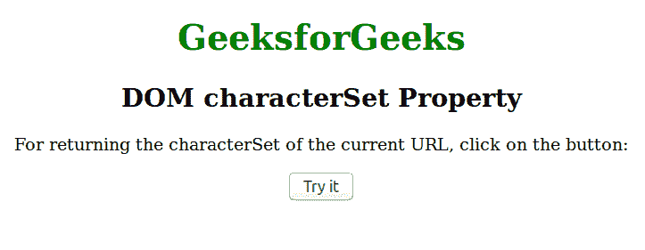
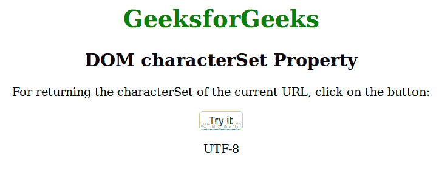

# HTML | DOM 字符集属性

> 原文:[https://www . geesforgeks . org/html-DOM-character set-property/](https://www.geeksforgeeks.org/html-dom-characterset-property/)

**字符集**属性用于在解析时返回文档的字符编码。它是用于文档呈现的字符集，用户也可以覆盖编码。如果文档是在内存中创建的，则**字符集**属性将返回*空值*。

**语法:**

```html
document.characterSet
```

**返回值:**一个字符串，表示文档的字符编码

**例:**

## 超文本标记语言

```html
<!DOCTYPE html>
<html>

<head>
    <title>DOM characterSet Property</title>
    <style>
        h1 {
            color: green;
        }

        h2 {
            font-family: Impact;
        }

        body {
            text-align: center;
        }
    </style>
</head>

<body>
    <h1>GeeksforGeeks</h1>
    <h2>DOM characterSet Property</h2>

<p>For returning the characterSet of the current URL,
      click on the button: </p>

    <button onclick="myFunction()">Try it</button>
    <p id="demo"></p>

   <!-- Script to get the characterSet -->
    <script>
        function myFunction() {
            var x = document.characterSet;
            document.getElementById("demo").innerHTML = x;
        }
    </script>
</body>

</html>

```

**输出:**



点击按钮后:



**支持的浏览器:**

*   谷歌 Chrome 45.0
*   Internet Explorer 9.0
*   Firefox 44.0
*   Opera 34.0
*   Safari 9.0