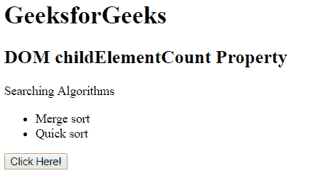
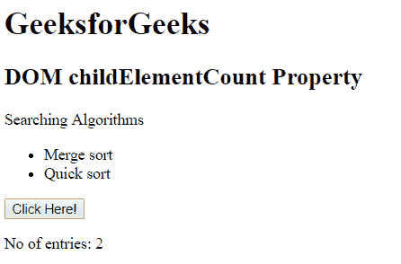

# HTML | DOM childElementCount 属性

> 原文:[https://www . geesforgeks . org/html-DOM-childelementcount-property/](https://www.geeksforgeeks.org/html-dom-childelementcount-property/)

**DOM childElementCount 属性**用于统计子元素的个数并返回。它只计算除文本和注释节点之外的子元素。

**语法:**

```html
node.childElementCount
```

其中节点是表示文档或元素的对象。

**返回值:**返回给定元素的子元素个数。

**示例:**

```html
<!DOCTYPE html>
<html>

<head>
    <title>
        DOM childElementCount Property
    </title>
</head>

<body>
    <h1>GeeksforGeeks</h1>

    <h2>
            DOM childElementCount Property
        </h2>

    <p>Searching Algorithms</p>

    <ul id="parent">
        <li>Merge sort</li>
        <li>Quick sort</li>
    </ul>

    <button onclick="geek()">Click Here!</button>

    <p id="p"></p>

    <script>
        function geek() {
            var doc = 
                document.getElementById("parent").childElementCount;
            document.getElementById("p").innerHTML =
                  "No of entries: " + doc;
        }
    </script>
</body>

</html>
```

**输出:**
**点击按钮前:**

**点击按钮后:**


**支持的浏览器:**DOM childElementCount 属性支持的浏览器如下:

*   谷歌 Chrome 2.0
*   Internet Explorer 9.0
*   Firefox 3.5
*   opera10.0
*   Safari 4.0