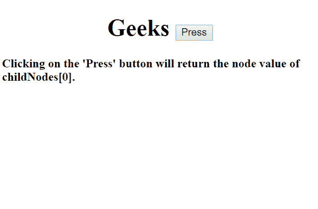

# HTML | DOM 子节点属性

> 原文:[https://www.geeksforgeeks.org/html-dom-childnodes-property/](https://www.geeksforgeeks.org/html-dom-childnodes-property/)

**子节点属性**返回一个节点的子节点作为*节点列表*对象。*空格*和*注释*也被认为是节点。从 *0* 开始，为节点分配索引号。*搜索*和*排序*操作可以使用节点列表上的索引号进行。

**语法:**

```html
elementNodeReference.childNodes;
```

**返回值:**返回特定节点的子节点集合作为**节点列表**对象(包括空格、文本和注释，视为节点)。

**属性:**

1.  **length property:** It determines the number of **child nodes** of the object. It is a *read only property*.
    **Syntax:**

    ```html
    elementNodeReference.childNodes.length;
    ```

    ```html
    elementNodeReference.childNodes[index_number].length;
    ```

    **示例-1:** 显示长度属性。

    ```html
    <!DOCTYPE html>
    <html>

    <body>
        <h1><center>Geeks
        <button onclick="node()">Press</button>
       </center> </h1>

            <h4>Clicking on the 'Press' button will return 
              the length of childNodes[0].</h4>

        <p id="gfg"></p>

        <script>
            function node() {

                // Return the length of child node.
                var c = document.getElementsByTagName(
                  "BUTTON")[0];
                var x = c.childNodes[0].length;
                document.getElementById("gfg").innerHTML = x;
            }
        </script>

    </body>

    </html>
    ```

    **输出:**

    **点击按钮前:**
    

    **点击按钮后:**
    

2.  **nodeName property:** It returns the name of the specified node. If the node is an element node, it will return the tag name else if the node is an attribute node, it will return the attribute name else for different node types, different names will be returned.

    **语法:**

    ```html
    elementNodeReference.childNodes[index_number].nodeName;
    ```

    **示例-2:显示节点名称属性**

    ```html
    <!DOCTYPE html>
    <html>

    <body>
        <h1><center>Geeks 
          <button onclick="node()">Press
          </button></center> </h1>

            <h4>Clicking on the 'Press' button will 
              return the node name of childNodes[0].</h4>

        <p id="gfg"></p>

        <script>
            function node() {

                //  Return the name of specific node name.
                var c = document.getElementsByTagName(
                  "BUTTON")[0];
                var x = c.childNodes[0].nodeName;
                document.getElementById("gfg").innerHTML = x;
            }
        </script>

    </body>

    </html>
    ```

    **输出:**

    **点击按钮前:**
    

    **点击按钮后:**
    

3.  **nodeValue property:** It sets or returns the node value of the specified node.

    **语法:**

    ```html
    elementNodeReference.childNodes[index_number].nodeValue;
    ```

    **示例-3:** 显示节点值属性

    ```html
    <!DOCTYPE html>
    <html>

    <body>
        <h1><center>Geeks 
          <button onclick="node()">Press
          </button></center> </h1>

            <h4>Clicking on the 'Press' button will 
              return the node value of childNodes[0].</h4>

        <p id="gfg"></p>

        <script>
            function node() {

                // Return the node value.
                var c = document.getElementsByTagName("BUTTON")[0];
                var x = c.childNodes[0].nodeValue;
                document.getElementById("gfg").innerHTML = x;
            }
        </script>

    </body>

    </html>
    ```

    **输出:**

    **点击按钮前:**
    

    **点击按钮后:**
    

**浏览器支持:**列出的浏览器支持 **DOM 子节点**属性:

*   谷歌 Chrome
*   火狐浏览器
*   微软公司出品的 web 浏览器
*   歌剧
*   旅行队