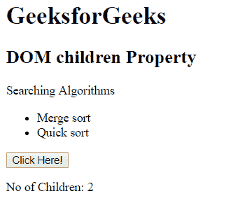

# HTML | DOM 子属性

> 原文:[https://www.geeksforgeeks.org/html-dom-children-property/](https://www.geeksforgeeks.org/html-dom-children-property/)

**DOM 子属性**用于返回指定元素的所有子元素的 HTMLcollection。集合中的元素可以通过索引号来访问。它不同于子节点，因为子节点包含所有节点(即它也包含文本和注释节点)，但另一方面，子节点只包含元素节点。这是只读属性。

**语法:**

```html
element.children
```

**返回值:**返回可通过索引访问的元素节点集合。

**示例 1:** 本示例返回列表项的数量。

```html
<!DOCTYPE html>
<html>

<head>
    <title>
        HTML DOM children Property
    </title>

    <!-- Script to count children of parent attribute -->
    <script>
        function Geeks() {
            var count =
                document.getElementById("parent").children.length;

            document.getElementById("p").innerHTML = 
                  "No of Children: " + count;
        }
    </script>
</head>

<body>
    <h1>GeeksforGeeks</h1>

    <h2>
            DOM children Property
        </h2>

    <p>Searching Algorithms</p>

    <ul id="parent">
        <li>Merge sort</li>
        <li>Quick sort</li>
    </ul>

    <button onclick="Geeks()">
        Click Here!
    </button>

    <p id="p"></p>
</body>

</html>
```

**输出:**
**点击按钮前:**

点击按钮后:


**例 2:**

```html
<!DOCTYPE html>
<html>
    <head>
        <title>
            HTML DOM children Property
        </title>

        <script>
            function Geeks() {
                var doc = 
                document.getElementById("parent").children;

                var i;
                for(i = 0; i < doc.length; i++) {
                    doc[i].style.color = "white";
                    doc[i].style.backgroundColor = "green";
                }
            }
        </script>
    </head>

    <body style = "text-align:center">

        <h1 style = "color:green;">
            GeeksforGeeks
        </h1>

        <h2>
            DOM children Property
        </h2>

        <div id = "parent">
            <p>
                A computer science portal for geeks.
            </p>
            <p>
                Geeks classes an extensive programme for geeks.
            </p>
        </div>

        <button onclick = "Geeks()">Click me!</button>
    </body>
</html>                    
```

**输出:**
**之前点击按钮:**

**之后点击按钮:**


**支持的浏览器:**T2 DOM 子代属性支持的浏览器如下:

*   谷歌 Chrome 2.0
*   Internet Explorer 9.0*
*   Firefox 3.5
*   opera10.0
*   苹果 Safari 4.0