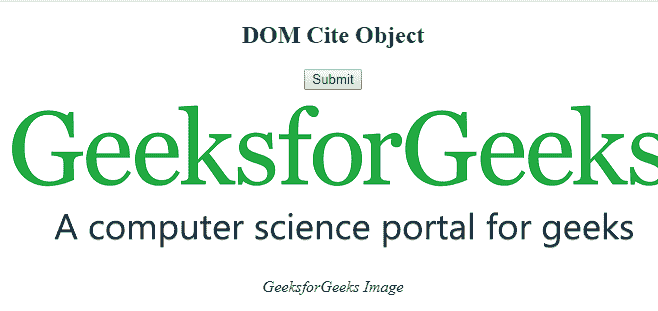

# HTML | DOM 引用对象

> 原文:[https://www.geeksforgeeks.org/html-dom-cite-object/](https://www.geeksforgeeks.org/html-dom-cite-object/)

**DOM 引用对象**用于表示 [HTML <引用>元素](https://www.geeksforgeeks.org/html-cite-tag/)。引用元素由**获取元素 ById()** 访问。
**语法**

```html
document.getElementById("id");
```

其中“id”是分配给**引用**标签的 ID。
**示例-1:**

## 超文本标记语言

```html
<!DOCTYPE html>
<html>

<head>
    <title>DOM cite Object</title>
    <style>
        body {
            text-align: center;
        }
    </style>
</head>

<body>
    

    <!-- cite id-->

<p><cite id="GFG">GeeksforGeeks Image</cite></p>

    <button onclick="Geeks()">Submit</button>

    <script>
        function Geeks() {
            var w = document.getElementById("GFG");
            w.style.color = "coral";
            w.style.fontWeight = "bold";
        }
    </script>
</body>

</html>            
```

**输出:**
**点击按钮前:**


**点击按钮后:**


**示例-2:** 引用对象可以使用**文档.创建元素**方法创建。

## 超文本标记语言

```html
<!DOCTYPE html>
<html>

<head>
    <title>DOM cite Object</title>
    <style>
        body {
            text-align: center;
        }
    </style>
</head>

<body>
    <h2>DOM Cite Object</h2>

    <button onclick="Geeks()">
      Submit
    </button>

    

    <script>
        function Geeks() {
            var cite = document.createElement("CITE");

            var text =
            document.createTextNode("GeeksforGeeks Image");

            cite.appendChild(text);
            document.body.appendChild(cite);
        }
    </script>
</body>

</html>                   
```

**输出**
**点击按钮前:**


**点击按钮后:**



**支持的浏览器:****DOM Cite Object**支持的浏览器如下:

*   谷歌 Chrome
*   微软公司出品的 web 浏览器
*   火狐浏览器
*   歌剧
*   旅行队