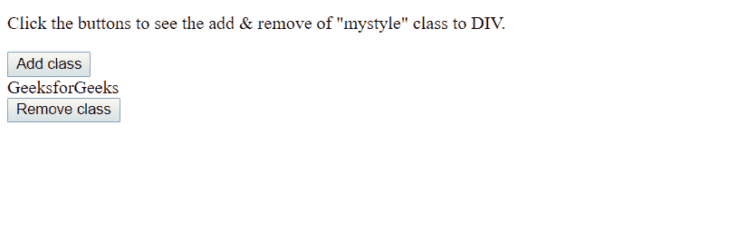
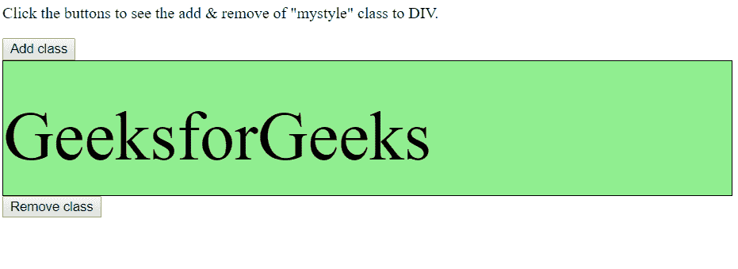
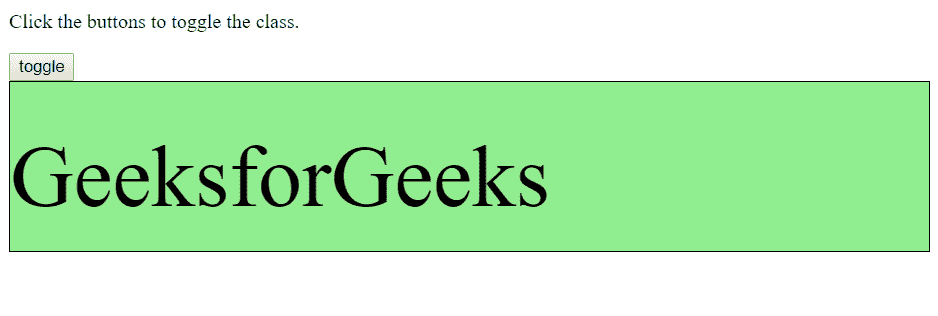
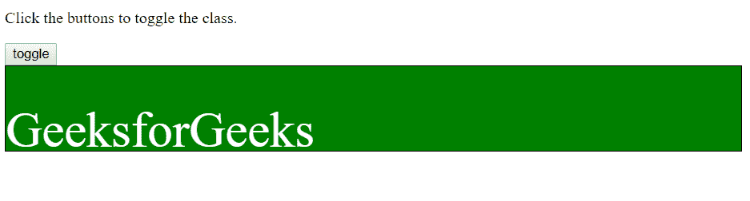
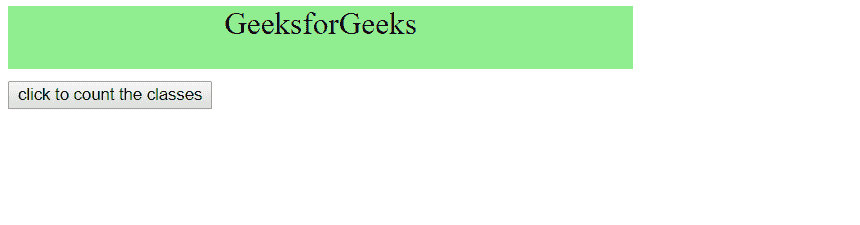
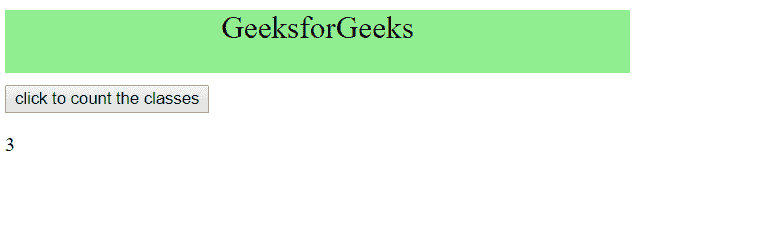

# HTML | DOM 类列表属性

> 原文:[https://www.geeksforgeeks.org/html-dom-classlist-property/](https://www.geeksforgeeks.org/html-dom-classlist-property/)

**类列表属性**是只读属性。此属性使用“classList.length”属性，该属性以 DOMTokenlist(一组用空格分隔的标记)的形式返回元素的类名。但是，此属性用于在元素上添加、移除和切换 CSS 类。
**注意:**IE9 及更早版本不支持 classList 属性。
**语法:**

```html
  const elementClasses = elementNodeReference.classList;
```

**方法:**

*   **添加(类 1、类 2、……):**给元素再添加一个类。如果上述类已经存在于元素的类属性中，它们将被忽略。

*   **移除(类 1、类 2、…) :** 从元素中移除指定的类。不存在的类不会引发错误。

*   **包含(类):**检查元素的类属性中是否存在指定的类值。相应地返回布尔值。

*   **item(index) :** 这将按类集合中的索引返回类值。如果索引超出范围，则返回 null。

*   **切换(类，力):**在元素的类名之间切换。
    1.  第一个参数从元素中移除指定的类，并返回 false。如果类不存在，它会将类添加到元素中，并且返回 true。

    2.  可选的第二个参数是一个布尔值，它强制添加或移除类。当第二个参数存在并且计算结果为 true 时，添加指定的类值，如果计算结果为 false，则强制移除指定的类，不管它是否存在。

**示例-1:** 添加和删除类。

## 超文本标记语言

```html
<!DOCTYPE html>
<html>

<head>
    <title>
        HTML | DOM classList Property
    </title>
    <style>
        .mystyle {
            align: center;
            border: 1px solid black;
            height: 100px;
            padding-top: 35px;
            background: lightgreen;
            color: Black;
            font-size: 70px;
        }
    </style>

</head>

<body>

<p>
      Click the buttons to see the add and
      remove of "mystyle" class to DIV.
    </p>

    <button onclick="myFunction()">
      Add class
    </button>

    <div id="myDIV">
        GeeksforGeeks
    </div>

    <script>
        function myFunction() {

            document.getElementById(
                "myDIV").classList.add("mystyle");

        }

        function Remove() {
            document.getElementById(
                "myDIV").classList.remove("mystyle");
        }
    </script>

    <button onclick="Remove()">Remove class</button>

</body>

</html>
```

**输出:**

*   **添加班级前**



*   **点击**添加班级按钮后



*   **点击**后移除类按钮


**示例-2:** 在类之间切换

## 超文本标记语言

```html
<!DOCTYPE html>

<html>

<head>
    <title>
        HTML | DOM classList Property
    </title>

    <style>
        .mystyle {
            align: center;
            border: 1px solid black;
            height: 100px;
            padding-top: 35px;
            background: lightgreen;
            color: Black;
            font-size: 70px;
        }

        .newClassName {
            align: center;
            border: 1px solid black;
            height: 50px;
            padding-top: 35px;
            background: green;
            color: white;
            font-size: 50px;
        }
    </style>

</head>

<body>

<p>
      Click the buttons to see the add and
      remove of "mystyle" class to DIV.
    </p>

    <button onclick="myFunction()">
        toggle
    </button>

    <div id="myDIV" class="mystyle">
        GeeksforGeeks
    </div>

    <script>
        function myFunction() {

            document.getElementById(
                "myDIV").classList.toggle("newClassName");

        }
    </script>

</body>

</html>
```

**输出:**

*   **在拨动**之前



*   **拨动**后



**示例-3:**

## 超文本标记语言

```html
<!DOCTYPE html>
<html>

<head>
    <title>
        HTML | DOM classList Property
    </title>
    <style>
        .mystyle {
            width: 500px;
            height: 50px;
        }

        .anotherClass {
            background-color: lightGreen;
        }

        .thirdClass {
            text-align: center;
            font-size: 25px;
            color: black;
            margin-bottom: 10px;
        }
    </style>

</head>

<body>

    <div id="myDIV" class="mystyle anotherClass thirdClass">

        GeeksforGeeks

    </div>

    <button onclick="myFunction()">
        click to count the classes
    </button>

    <p id="demo"></p>

    <script>
        function myFunction() {

            var x = document.getElementById(
                "myDIV").classList.length;

            document.getElementById("demo").innerHTML = x;

        }
    </script>

</body>

</html>
```

**输出:**

*   **之前点击**



*   **点击**后



**支持的浏览器:***DOM 类列表属性*支持的浏览器如下:

*   谷歌 Chrome 8.0
*   Internet Explorer 10.0
*   Firefox 3.6
*   歌剧 11.5
*   Safari 5.1