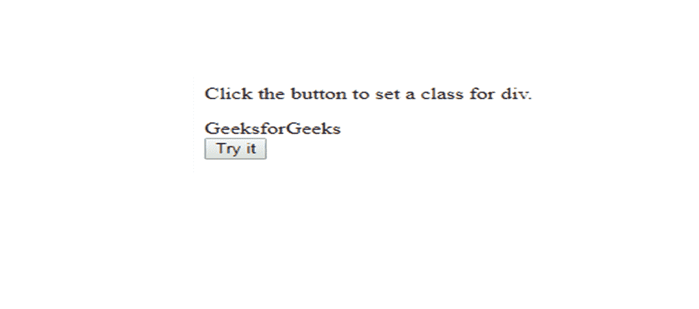
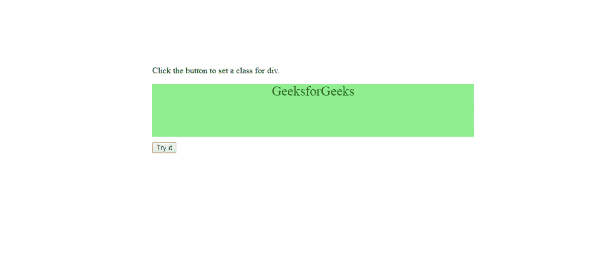
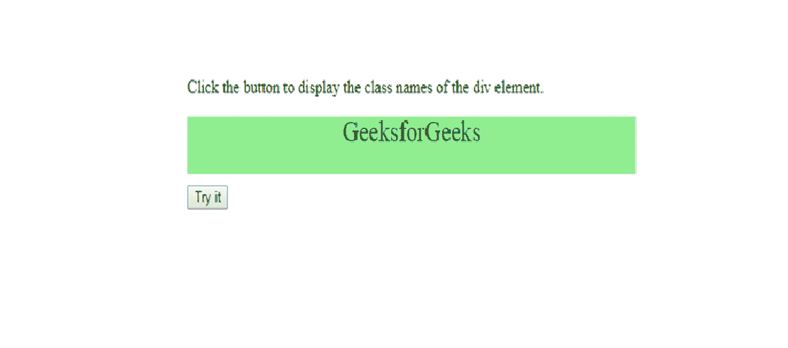
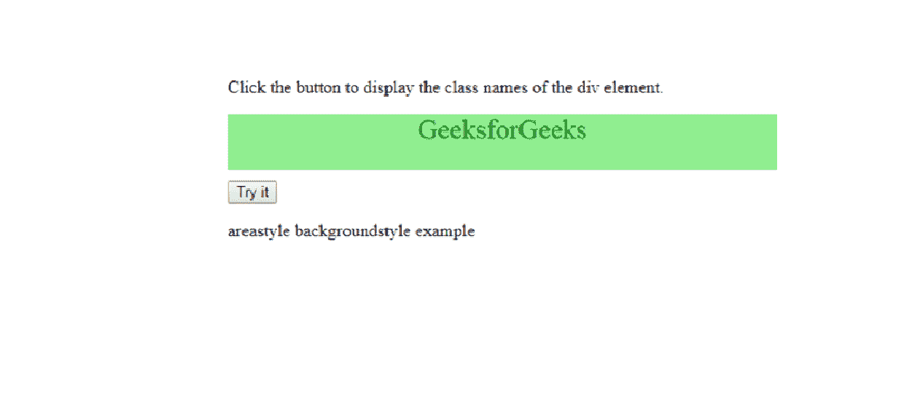
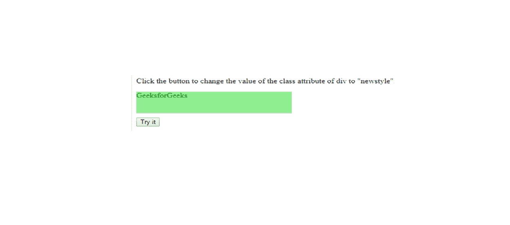
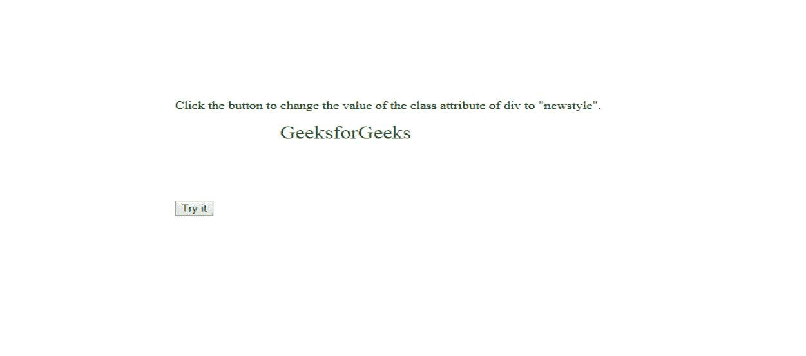

# HTML | DOM 类名属性

> 原文:[https://www.geeksforgeeks.org/html-dom-classname-property/](https://www.geeksforgeeks.org/html-dom-classname-property/)

在 HTML 文档中，**类名属性**用于设置或返回元素的类属性的值。使用此属性，用户可以将元素的类更改为所需的类。

**语法:**

*   返回类名属性

    ```html
    HTMLElementObject.className;

    ```

    *   sets the className property

    ```html
    HTMLElementObject.className = class;

    ```

    **类名**指定元素的类名。若要应用多个类，请使用空格将它们分开。例如，如果一个元素有两个类，那么我们将它们指定为“类名 1 类名 2”，其中类名 1 和类名 2 是两个不同类的名称。className 属性返回一个字符串或一个以空格分隔的元素类列表。

    **示例-1:** 本示例为< div >元素设置类。

    ```html
    <!DOCTYPE html>
    <html>

    <head>
        <title>
            HTML | DOM className Property
        </title>
        <style>
            .do_style {
                width: 600px;
                height: 100px;
                background-color: lightgreen;
                text-align: center;
                font-size: 25px;
                color: green;
                margin-bottom: 10px;
            }
        </style>
    </head>

    <body>

        <p>Click the button to set a class for div.</p>

        <div id="div1">
            GeeksforGeeks
        </div>

        <button onclick="myFunction()">Try it</button>

        <script>
            function myFunction() {
                document.getElementById("div1").className =
                    "do_style";
            }
        </script>

    </body>

    </html>
    ```

    **输出:**
    **点击按钮前:**

    

    最初

    **点击按钮后:**

    

    单击“尝试”按钮后

    *   **Explanation:** The class for < div> element is assigned a value using className property.

    **示例-2:** 本示例获取< div >元素的类。

    ```html
    <!DOCTYPE html>
    <html>

    <head>
        <title>
            HTML | DOM className Property
        </title>
        <style>
            .do_style {
                width: 600px;
                height: 100px;
                background-color: lightgreen;
                text-align: center;
                font-size: 25px;
                color: green;
                margin-bottom: 10px;
            }
        </style>
    </head>

    <body>

        <p>Click the button to set a class for div.</p>

        <div id="div1">
            GeeksforGeeks
        </div>

        <button onclick="myFunction()">Try it</button>

        <script>
            function myFunction() {
                document.getElementById("div1").className =
                    "do_style";
            }
        </script>

    </body>

    </html>
    ```

    **输出:**

    **点击按钮前:**

    

    最初

    **点击按钮后:**

    

    按下后试一下按钮

    **示例-3:** 本示例覆盖现有类名。

    ```html
    <!DOCTYPE html>
    <html>

    <head>
        <title>
            HTML | DOM className Property
        </title>
        <style>
            .oldstyle {
                width: 300px;
                height: 50px;
                background-color: lightgreen;
                color: green;
                margin-bottom: 10px;
            }

            .newstyle {
                width: 400px;
                height: 100px;
                background-color: white;
                text-align: center;
                font-size: 25px;
                color: green;
                margin-bottom: 10px;
            }
        </style>
    </head>

    <body>

        <p>
          Click the button to change the value of the
          class attribute of div to "newstyle".
        </p>

        <div id="div1" class="oldstyle">
            GeeksforGeeks
        </div>

        <button onclick="myFunction()">
            Try it
        </button>

        <script>
            function myFunction() {
                document.getElementById("div1").className =
                    "newstyle";
            }
        </script>

    </body>

    </html>
    ```

    **输出:**

    **点击按钮前:**

    

    最初

    **点击按钮后:**

    

    按下后试试

    **支持的浏览器:**

    *   谷歌 Chrome
    *   微软公司出品的 web 浏览器
    *   火狐浏览器
    *   歌剧
    *   旅行队