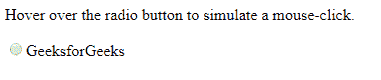
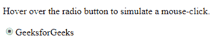

# HTML | DOM 点击()方法

> 原文:[https://www.geeksforgeeks.org/html-dom-click-method/](https://www.geeksforgeeks.org/html-dom-click-method/)

**click()** 方法用来模拟鼠标点击一个元素。此方法的工作方式与手动单击元素完全相同。
**语法:**

```html
HTMLElementObject.click()
```

**参数:**不需要参数。
**返回值:**无返回值。
**示例:**在本例中，当光标经过单选按钮时，它将执行鼠标单击事件，并且单选按钮在被手动单击时被选中。

## 超文本标记语言

```html
<!DOCTYPE html>
<html>

<head>
    <title>
        HTML | DOM click() method
    </title>
    <!--script to stimulate mouse click-->
    <script>
        function click() {
            document.getElementById("input1").click();
        }
    </script>
</head>

<body>

<p>
      Hover over the radio button to simulate
      a mouse-click.
    </p>

    <form>
        <input type="radio" id="input1"
               onmouseover="click()">
      GeeksforGeeks
    </form>

</body>

</html>
```

**输出:**
**之前在单选按钮上悬停:**



**悬停在单选按钮上后:**



**支持的浏览器:**DOM**支持的浏览器点击()**方法如下:

*   谷歌 Chrome
*   微软公司出品的 web 浏览器
*   火狐浏览器
*   歌剧
*   旅行队