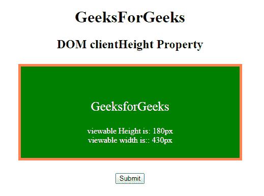

# HTML | DOM clientHeight 属性

> 原文:[https://www . geesforgeks . org/html-DOM-client height-property/](https://www.geeksforgeeks.org/html-dom-clientheight-property/)

**DOM clientHeight** 属性用于根据像素返回元素的可视高度。它包括填充宽度的度量，但不包括元素宽度度量的边距、边框和滚动条属性。此属性仅返回用户可见的元素的实际高度。它是只读属性。

**语法:**

```html
element.clientHeight
```

**返回值:**返回一个代表元素可视高度的数值。

**示例:**

```html
<!DOCTYPE html>
<html>

<head>
    <title>
        HTML | DOM clientHeight Property
    </title>
    <style>
        h1 {
            color: green;
            font-size: 35px;
        }

        #GFG {
            height: 100px;
            width: 350px;
            padding: 40px;
            margin: 25px;
            border: 5px solid coral;
            background-color: green;
        }
    </style>
</head>

<body>
    <center>
        <h1>GeeksForGeeks</h1>
        <h2>DOM clientHeight Property </h2>

        <div id="GFG">
            <p style="color:white;font-size:25px;">
                GeeksforGeeks
            </p>
            <p id="sudo" style="color:white;"></p>
        </div>
        <button onclick="Geeks()">Submit</button>
        <script>
            function Geeks() {
                var w = document.getElementById("GFG");

                // Using clientHeight property
                var x = "viewable Height is: " 
                + w.clientHeight + "px<br>";

                x += "viewable width is:: " 
                + w.clientWidth + "px";
                document.getElementById("sudo").innerHTML = x;
            }
        </script>
  </center>

</body>

</html>
```

**输出:**

*   **最初:**
    
*   **点击按钮后:**
    

**支持的浏览器:**DOM client height 属性支持的浏览器如下:

*   谷歌 Chrome 1.0
*   Internet Explorer 4.0
*   Firefox 1.0
*   歌剧 3.5
*   Safari 1.0