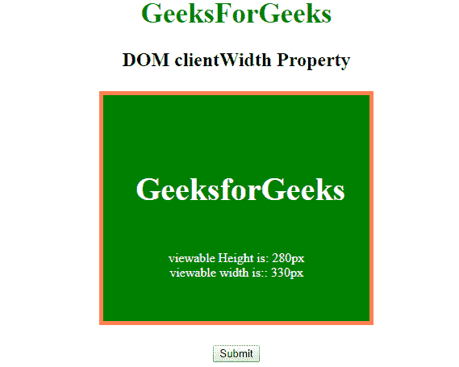

# HTML | DOM clientWidth 属性

> 原文:[https://www . geesforgeks . org/html-DOM-client width-property/](https://www.geeksforgeeks.org/html-dom-clientwidth-property/)

**DOM clientWidth** 属性用于返回特定元素的可视宽度，包括填充，但不包括边距、边框和滚动条宽度的测量。此属性仅返回用户可见的元素的实际宽度。它是只读属性。
**语法:**

```html
element.clientWidth 
```

**返回值:**返回一个代表元素可视宽度的数值。
T3】例:

```html
<!DOCTYPE html>
<html>

<head>
    <title>
        HTML | DOM clientWidth Property
    </title>
    <style>
        h1 {
            color: green;
            font-size: 35px;
        }

        #GFG {
            height: 200px;
            width: 250px;
            padding: 40px;
            margin: 25px;
            border: 5px solid coral;
            background-color: green;
        }
    </style>
</head>

<body>
    <center>
        <h1>GeeksForGeeks</h1>
        <h2>DOM clientWidth Property </h2>

        <div id="GFG">
            <h4 style="color:white;font-size:40px;">
                 GeeksforGeeks
            </h4>
            <p id="sudo" style="color:white;"></p>
        </div>
        <button onclick="Geeks()">Submit</button>
        <script>
            function Geeks() {
                var w = document.getElementById("GFG");
                var x = "viewable Height is: " 
                + w.clientHeight +
                    "px<br>";
                x += "viewable width is:: "
                + w.clientWidth + "px";
                document.getElementById("sudo").innerHTML = x;
            }
        </script>
    </center>

</body>

</html>
```

**输出:**
**点击按钮前:**

**点击按钮后**

**支持的浏览器:**DOM**client width**属性支持的浏览器如下:

*   谷歌 Chrome 1.0
*   Internet Explorer 4.0
*   Firefox 1.0
*   歌剧 3.5
*   Safari 1.0