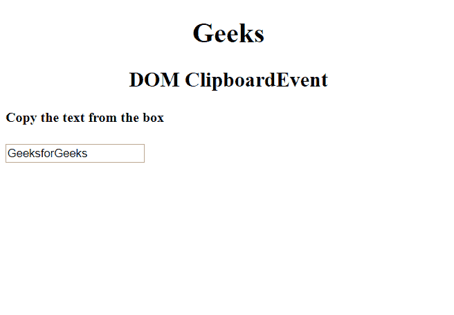
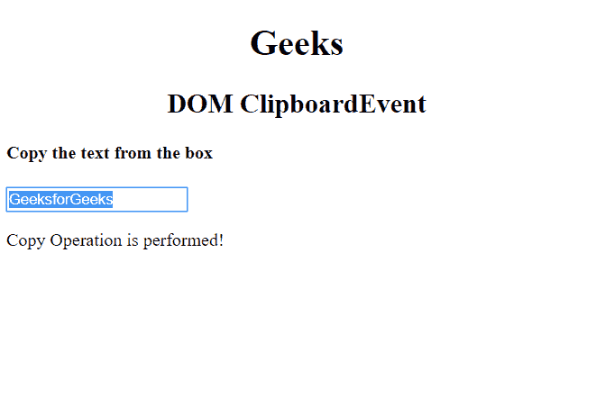
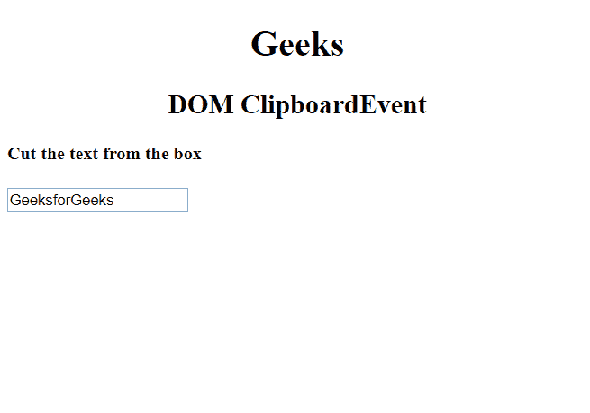
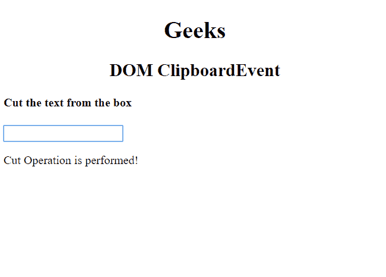
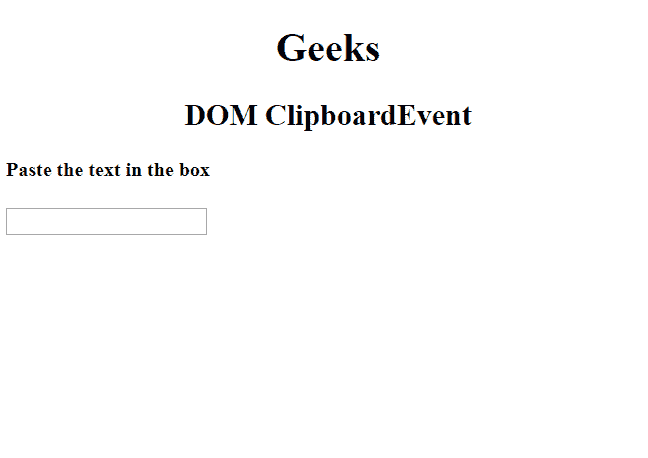
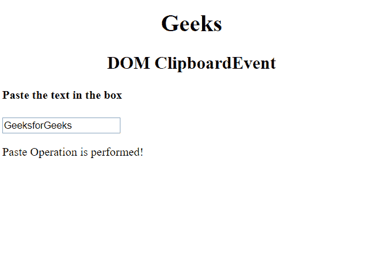

# HTML | DOM ClipboardEvent

> 哎哎哎::1230【https://www . geeksforgeeks . org/html-DOM-clipboard event/

**剪贴板事件**是指剪贴板被修改时发生的所有事件。所有的属性和方法都继承自“事件对象”。
有 3 个主要的剪贴画事件:

*   oncopy
*   oncut
*   你有吗

**返回值:**返回包含受剪贴板操作影响的数据的对象。

**剪贴板事件**

1.  **1.oncopy:** 用于复制元素的内容。
    **语法:**

> <input type="”text”" oncopy="”function_name()”" value="”copy_operation_content”">

**示例-1:** 显示肿瘤复制事件。

```html
<!DOCTYPE html>
<html>

<body>

    <h1><center>Geeks</center> </h1>

    <h2><center>DOM ClipboardEvent</center></h2>

    <h4>Copy the text from the box</h4>
    <input type="text" oncopy="clip()" value="GeeksforGeeks">

    <p id="gfg"></p>

    <script>
        function clip() {
            document.getElementById("gfg").innerHTML = 
              "Copy Operation is performed!"
        }
    </script>

</body>

</html>
```

**输出:**

*   **执行复制操作前:**
    
*   **执行复制操作后:**
    

*   **oncut:** It is used to cut the content of an element.
    **Syntax:**

    > <input type="”text”" oncut="”function_name()”" value="”cut_operation_content”">

    **示例-2:** 显示 oncut 事件

    ```html
    <!DOCTYPE html>
    <html>

    <body>

        <h1><center>Geeks</center> </h1>

            <h2><center>DOM ClipboardEvent</center></h2>

            <h4>Cut the text from the box</h4>
        <input type="text" oncut="clip()" value="GeeksforGeeks">

        <p id="gfg"></p>

        <script>
            function clip() {
                document.getElementById("gfg").innerHTML = 
                  "Cut Operation is performed!"
            }
        </script>

    </body>

    </html>
    ```

    **输出:**

    *   **执行切割操作前:**
        
    *   **执行切割操作后:**
        *   **onpaste:** It is used to paste content in an element.
    **Syntax:**

    > <input type="”text”" onpaste="”function_name()”" value="”Paste_operation_content”">

    **示例-3:** 显示上一个事件

    ```html
    <!DOCTYPE html>
    <html>

    <body>

        <h1><center>Geeks</center> </h1>

        <h2><center>DOM ClipboardEvent</center></h2>

        <h4>Paste the text in the box</h4>
        <input type="text" onpaste="clip()" value="">

        <p id="gfg"></p>

        <script>
            function clip() {
                document.getElementById("gfg").innerHTML = 
                  "Paste Operation is performed!"
            }
        </script>

    </body>

    </html>
    ```

    **输出:**

    *   **执行粘贴操作前:**
        
    *   **执行粘贴操作后:**
        

    **浏览器支持:**列出的浏览器支持**剪贴板事件**:

    *   谷歌 Chrome
    *   火狐浏览器
    *   微软公司出品的 web 浏览器
    *   歌剧
    *   旅行队