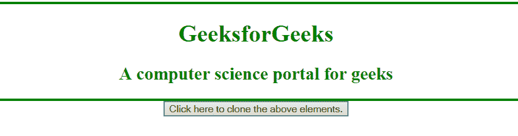
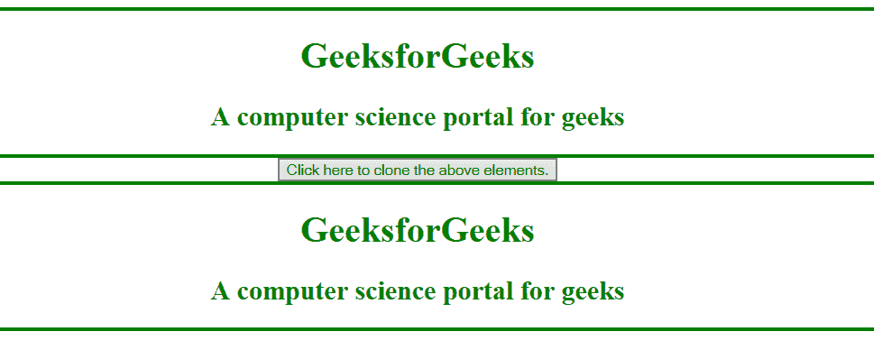
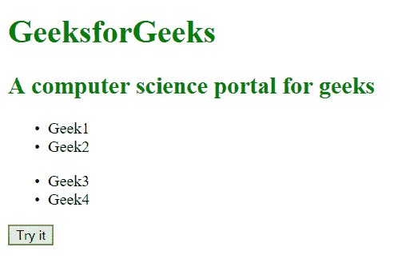
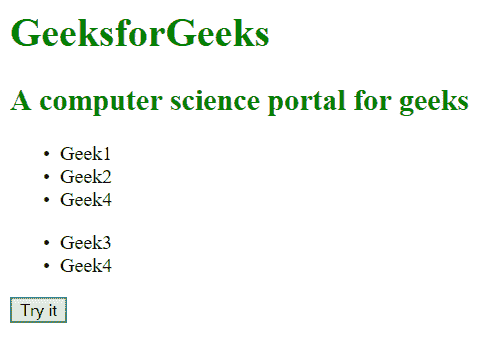

# HTML | DOM cloneNode()方法

> 原文:[https://www.geeksforgeeks.org/html-dom-clonenode-method/](https://www.geeksforgeeks.org/html-dom-clonenode-method/)

**DOM cloneNode()方法**用于复制或克隆调用 cloneNode()方法的节点。例如，可以使用此方法将列表项从一个列表复制到另一个列表。
**语法:**

```html
yourNode.cloneNode([deep])
```

**【深度】**是可选参数。如果我们想复制节点及其属性和子节点，我们可以将其值设置为“真”，如果我们只想复制节点及其属性，则设置为“假”。
**注:**如果不指定任何参数，则**【深】**的值默认为真。
**示例-1:**

## 超文本标记语言

```html
<!DOCTYPE html>
<html>

<head>
    <title>HTML|DOM cloneNode() Method</title>
    <!-- Set CSS property to the element -->
    <style>
        h1,
        h2 {
            color: green;
        }
    </style>
</head>

<body style="text-align: center;">
    <div style="border:3px solid green">
        <h1>
           GeeksforGeeks
        </h1>

        <h2>
          A computer science portal for geeks
        </h2>
    </div>

    <button onclick="nClone()">
        Click here to clone the above elements.
    </button>

    <!-- nClone() function is used to fetch our node
     and apply cloneNode method on it
     and cloning it with another element-->
    <script>
        function nClone() {
            // accessing div attribute using a
            //variable geek
            var geek =
                document.getElementsByTagName("DIV")[0];

            // cloning geek variable into a variable
           //named clone
            var clone = geek.cloneNode(true);

            // adding our clone variable to end
             //of the document
            document.body.appendChild(clone);
        }
    </script>
</body>

</html>
```

**输出:**
**点击按钮前:**



**点击按钮后:**



**示例-2:**

## 超文本标记语言

```html
<!DOCTYPE html>
<html>

    <head>
        <title>HTML|DOM cloneNode() Method</title>
        <!-- Set CSS property to the element -->
        <style>
        h1, h2 {
                color: green;
            }
        </style>
    </head>

<body>
<h1>GeeksforGeeks</h1>
<h2> A computer science portal for geeks</h2>
<ul id="list1"><li>Geek1</li><li>Geek2</li></ul>
<ul id="list2"><li>Geek3</li><li>Geek4</li></ul>

<button onclick="clone()">Try it</button>

<script>
    function clone() {
        // accessing list2 last item and storing it in a variable "geek"
            var listItem = document.getElementById("list2").lastChild;

        // cloning listItem variable into a variable named clone
        var clone = listItem.cloneNode(true);

            // adding our clone variable to end of the list1.
        document.getElementById("list1").appendChild(clone);    
    }
</script>
</body>

</html>                   
```

**输出:**
**点击按钮前:**



**点击按钮后:**



**支持的浏览器:**以下列出 *DOM cloneNode()方法*支持的浏览器:

*   谷歌 Chrome
*   微软公司出品的 web 浏览器
*   火狐浏览器
*   歌剧
*   旅行队