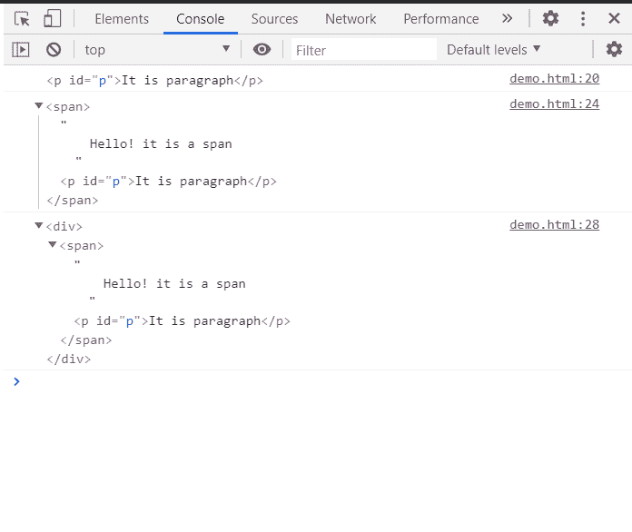

# HTML | DOM 最近()方法

> 原文:[https://www.geeksforgeeks.org/html-dom-closest-method/](https://www.geeksforgeeks.org/html-dom-closest-method/)

元素接口的**最近()**方法用于遍历 **HTML 文档树**中的元素及其父元素，直到找到与提供的**选择器**字符串匹配的**第一个节点**。

**语法:**

```html
targetElement.closest( selectors )

```

**参数:**该方法接受如上所述的单个参数，如下所述:

*   **选择器:**它是一个字符串，指定将用于查找节点的 HTML 选择器。

**返回值:**如果找到匹配的祖先，则该方法返回**最近的元素**，否则如果没有找到这样的元素，则返回 **null** 。

**示例:**以下示例通过在 HTML DOM 结构中搜索给定的元素，展示了**closer()**方法的用法。

## 超文本标记语言

```html
<!DOCTYPE html>
<html>

<head>
    <title>GeeksforGeeks</title>
</head>

<body>
    <div>
        <span>
            Hello! it is a span
            <p id="p">It is paragraph</p>
        </span>
    </div>

    <script>
        // Get the paragraph element
        var element = document.getElementById('p');

        // Return the closest paragraph element
        // which is the element itself
        var close1 = element.closest("p");
        console.log(close1)

        // Return the closest span element 
        var close2 = element.closest("span");
        console.log(close2)

        // Return the closest div element
        var close3 = element.closest("div");
        console.log(close3)  
    </script>
</body>

</html>
```

**输出:**

返回最接近选择器的元素。



**支持的浏览器:**以下是**DOM close()**T4 方法支持的浏览器:

*   谷歌 Chrome
*   边缘
*   火狐浏览器
*   苹果 Safari
*   歌剧